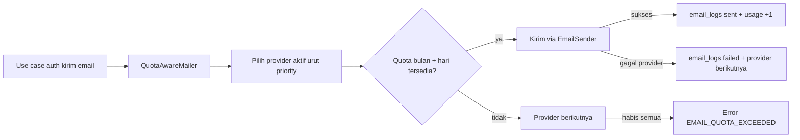

# API Email Quota & Log Email - Hardening Pengiriman

Hardening pengiriman email: quota tracking per-provider, failover otomatis,
dan log status kirim (tanpa isi email). Latar belakang: Resend gratis
3.000 email/bulan, bisa habis saat campaign. Kebutuhan admin meninjau log
email terkirim mengacu issue sambasku/console#16.

Status: **rencana disetujui, belum diimplement**. Doc ini acuan review dan
spec implementasi.

Keputusan desain (dikonfirmasi owner):

- **Brevo di-skip dulu**: implement pattern multi-provider + failover dengan satu sender terpasang (Resend). Pattern dibuktikan lewat unit test pakai 2 sender dummy. Sender Brevo menyusul saat `BREVO_API_KEY` siap - cukup tambah 1 file sender + 1 baris seed.
- Reset usage bulanan **struktural**: usage disimpan per hari, usage bulanan
  = SUM baris bulan berjalan. Otomatis 0 tiap tanggal 1 tanpa cron reset.
  Cron bulanan hanya untuk pruning log lama.

---

## Arsitektur



- `MailerPort` (auth) tidak berubah - use case login/OTP/reset tidak disentuh.
- `QuotaAwareMailer implements MailerPort` membungkus daftar `EmailSenderPort`.
- Konten email (OTP, reset password, hapus akun, verifier approved) tetap
  pakai builder yang ada di `api/src/modules/auth/infrastructure/*-email.ts`.

Modul baru: `api/src/modules/email/` (pola sama dengan `modules/system/`).

---

## Skema database (migration 0058)

Tiga tabel baru di `api/src/shared/database/drizzle/schema/email.schema.ts`:

### `email_quotas`

| Kolom | Tipe | Catatan |
|---|---|---|
| `provider` | text PK | `resend` \| `brevo` |
| `monthly_limit` | integer | 3000 (resend), 9000 (brevo) |
| `daily_limit` | integer | 100 (resend), 300 (brevo) |
| `manual_monthly_used` | integer | Email manual dari dashboard provider (req 4) |
| `manual_month` | text null | 'YYYY-MM' - penanda bulan manual untuk lazy reset |
| `priority` | integer | Urutan failover: resend 1 |
| `active` | integer bool | Nonaktif = dilewati failover |

### `email_usage_daily`

| Kolom | Tipe | Catatan |
|---|---|---|
| `id` | text ULID PK | |
| `provider` | text | FK logis ke `email_quotas` |
| `day` | text | `YYYY-MM-DD` (UTC) |
| `sent_count` | integer | |

Unique `(provider, day)`. Usage bulanan = SUM baris dengan prefix bulan.
Reset awal bulan gratis: bulan baru tidak punya baris.

### `email_logs`

| Kolom | Tipe | Catatan |
|---|---|---|
| `id` | text ULID PK | |
| `created_at` | timestamp | |
| `provider` | text | |
| `to_email` | text | |
| `category` | text | `otp` \| `reset_password` \| `account_deletion` \| `verifier_approved` \| `test` |
| `status` | text | `sent` \| `failed` \| `skipped_quota` |
| `error_code` | text null | |
| `error_message` | text null | |
| `provider_message_id` | text null | |

**Sengaja tanpa body/html/subject** sesuai issue #16: admin melihat status,
bukan isi email.

Seed: resend saja (3000/100, priority 1). Baris provider lain (brevo,
mailjet, dst.) ditambahkan saat sender + key-nya siap.

---

## Endpoint admin

Mount `/api/v1/admin/system/email`, role `admin` + `root`, pola
`system-supabase.routes.ts`.

### `GET /api/v1/admin/system/email/quota`

Daftar provider + pemakaian.

```json
{
  "success": true,
  "data": [
    {
      "provider": "resend",
      "monthly_limit": 3000,
      "daily_limit": 100,
      "month_used": 36,
      "today_used": 5,
      "manual_monthly_used": 0,
      "month_remaining": 2964,
      "priority": 1,
      "active": true
    }
  ]
}
```

`month_used` = SUM `email_usage_daily` bulan ini + `manual_monthly_used`.

### `PATCH /api/v1/admin/system/email/quota/:provider`

Body (semua opsional): `monthly_limit`, `daily_limit`,
`manual_monthly_used`, `active`, `priority`.

Untuk req 4: admin yang kirim email manual dari dashboard Resend/Brevo
menaikkan `manual_monthly_used` supaya tracking tetap akurat.

### `GET /api/v1/admin/system/email/logs`

Cursor pagination (`limit` default 20, `cursor` = id terakhir), filter
`status?`, `provider?`. Response per item: waktu, provider, category,
`to_email`, status, error_code. Tanpa isi email.

### `POST /api/v1/admin/system/email/test` (playground)

Kirim email test dari Console. Body:

```json
{ "to": "admin@example.com", "provider": "resend" }
```

- `provider` opsional: id provider dari `email_quotas` (sekarang `resend`;
  daftar lain mengikuti seed) atau kosong = auto (urutan priority +
  failover normal).
- Provider dipilih secara eksplisit tetap melewati pemeriksaan kuota yang
  sama; kuota habis → `EMAIL_QUOTA_EXCEEDED` (bukan jalan pintas).
- Terhitung di usage dan masuk `email_logs` dengan category baru `test`.
  Response berisi `provider` yang benar-benar dipakai + `message_id`.
- Rate limit ketat (5 req/menit) supaya tidak jadi pintu spam.

---

## Provider failover

- `EmailSenderPort`: `send({to, subject, text, html?, inlineLogo?})`.
- `resend-sender.ts`: ekstrak HTTP call dari `ResendMailerService` yang ada
  (fetch `https://api.resend.com/emails`). Satu-satunya sender terpasang
  sekarang.
- Pattern multi-provider: `QuotaAwareMailer` konstruktornya terima daftar
  `{provider, sender}` urut priority. Provider tanpa API key / tanpa baris
  `email_quotas` otomatis nonaktif dan dilewati failover.
- Sender berikutnya (Brevo: POST `https://api.brevo.com/v3/smtp/email`
  header `api-key`) tinggal tambah 1 file sender + env `BREVO_API_KEY` +
  1 baris seed `email_quotas`, tanpa menyentuh mailer core.
- Semua provider habis/gagal → `EMAIL_QUOTA_EXCEEDED` (503), use case
  tetap gagal jelas, tidak diam-diam skip.

Setiap kirim email dari use case manapun lewat `QuotaAwareMailer` karena
semua sudah bergantung pada `MailerPort` - pemeriksaan quota + log dijamin
di satu titik (req 6, 7).

---

## Cron pruning awal bulan

- `wrangler.toml` tambah cron `0 0 1 * *` (tanggal 1, 00:00 UTC).
- `worker.ts scheduled()` membedakan cron expression:
  - `0 0 1 * *` → `runEmailLogPruning()`: hapus `email_usage_daily` > 13
    bulan, `email_logs` > 180 hari.
  - `* * * * *` → campaign sending (yang sudah ada, tidak berubah).

Catatan: ini pruning penyimpanan, bukan reset counter. Reset usage tetap
struktural (baris per hari), tidak bisa lupa jalan.

---

## Console: System > Email Quota

- Route `/system/email`, entry sidebar di `SYSTEM_ROUTES`
  (`console/src/shared/layouts/console-layout.tsx`), label "Email Quota",
  icon `MailOutlined`.
- Fitur `console/src/features/system/email/` mengikuti pola supabase:
  `domain/email-quota.ts`, `infrastructure/email-quota-api.ts`,
  `application/use-email-quota.ts`, `presentation/system-email-page.tsx`.
- UI:
  - Kartu per provider: used/limit, sisa, badge aktif, priority.
  - Form ubah `monthly_limit`, `daily_limit`, `manual_monthly_used`,
    `active`, `priority` (req 4).
  - Tabel log: waktu, provider, kategori, tujuan, status (Tag warna),
    error code.
- Nada copy: Indonesia santai, hyphen ASCII, tanpa em/en dash.

---

## Alternatif provider selain Resend (jaga-jaga)

| Provider | Kuota gratis | HTTP API (Workers-safe) | Catatan |
|---|---|---|---|
| Brevo | 300/hari (~9.000/bln) | Ya | Fallback terpilih; akun + SMTP sudah disiapkan (lihat `docs/env/brevo.md`) |
| Mailjet | 200/hari, 6.000/bln | Ya | `POST https://api.mailjet.com/v3.1/send`, auth Basic (API key + secret), inline attachment via `ContentID`, paid $9/bln bebas limit harian |
| SendGrid | 100/hari | Ya | Butuh verifikasi sender |
| Amazon SES | $0.10 / 1.000 email | Ya | Termurah di skala besar, setup AWS |
| Postmark | 100/hari (trial) | Ya | Fokus transaksional |

Provider baru = satu file sender + satu baris seed `email_quotas`; urutan
failover diatur `priority` dari UI admin tanpa redeploy.

---

## Test & verifikasi

- Unit `quota-aware-mailer`: pakai 2 sender DUMMY (bukan HTTP) untuk
  membuktikan pattern - pemilihan provider by quota, failover saat
  provider gagal/habis kuota, increment usage, log tertulis, error saat
  semua habis.
- Edge case yang wajib ada di test: 4xx provider TIDAK memicu failover
  (429/5xx/timeout tetap failover), write log gagal tidak menggagalkan
  response, `manual_monthly_used` lazy-reset lintas bulan, staging
  no-op tidak memakan kuota, PATCH input negatif ditolak Zod.

---

## Hardening & edge case ringkas

| Edge case | Perlakuan |
|---|---|
| Race overshoot kirim | Increment atomik `ON CONFLICT DO UPDATE sent_count + 1` (advisory; overshoot 1-2 ditoleransi) |
| Batas hari/bulan | Bucket UTC, sama dengan siklus reset provider |
| `manual_monthly_used` reset bulan | Lazy reset via kolom `manual_month` (tanpa cron) |
| Provider timeout/hang | `AbortSignal.timeout(10_000)`, timeout = failover |
| 429/5xx provider | Failover ke provider berikutnya |
| 4xx provider (email invalid) | Tidak failover; log failed, error ke user |
| Log/usage gagal tulis setelah terkirim | Best-effort + logger.error, response tetap sukses |
| Semua provider lewati kuota | Log `skipped_quota` + 503 `EMAIL_QUOTA_EXCEEDED` (kode beda dari `EMAIL_SEND_FAILED`) |
| Staging | No-op seperti sekarang, log `skipped_env`, kuota tidak terpakai |
| Provider ber-key tanpa baris `email_quotas` | Nonaktif + warning (fail-closed per provider) |
| PATCH quota kotor | Zod (integer >= 0, priority >= 1) + catat `audit_logs` |
| Playground | Admin/root, rate limit 5/menit, email tervalidasi |
| Pruning dobel jalan | DELETE by cutoff idempoten |
