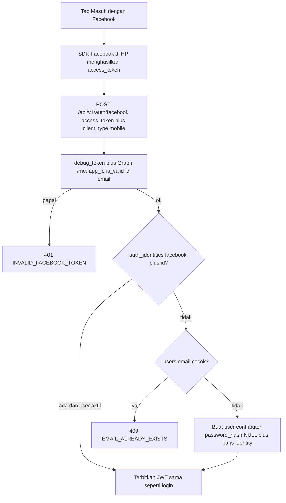

# AUTH_FACEBOOK - Masuk dengan Facebook

Status **V1 implemented** (2026-09-21). Keputusan produk yang tidak
dinegosiasi ulang. Duplikat pola
[`AUTH_GOOGLE.md`](AUTH_GOOGLE.md) untuk provider Facebook. Kontrak
hidup:
[`../api/29-api-auth-facebook.md`](../api/29-api-auth-facebook.md)
(backend),
[`../mobile/19-mobile-auth-facebook.md`](../mobile/19-mobile-auth-facebook.md)
(Flutter).

V1: **API + mobile**. Admin tetap email/password.

---

## Situasi sekarang

Login email/password sudah lengkap (JWT RS256, refresh web cookie /
mobile body). Register password wajib OTP email
([`AUTH_EMAIL_OTP.md`](AUTH_EMAIL_OTP.md)). Google Sign-In V1 sudah
jalan ([`AUTH_GOOGLE.md`](AUTH_GOOGLE.md)). Ubah password sudah
menolak akun OAuth-only (`OAUTH_NO_PASSWORD`).

Fondasi OAuth yang **sudah ada** (jangan diduplikasi, jangan buat
tabel baru):

- Migration `0008_auth-identities-oauth.sql`: tabel `auth_identities`,
  `users.password_hash` nullable. Kolom `provider` sudah `varchar(30)`
  (`google | github | apple | dst`); nilai `facebook` muat tanpa
  migrasi.
- Schema
  [`auth-identities.schema.ts`](../../api/src/shared/database/drizzle/schema/auth-identities.schema.ts)
- `AuthIdentityRepository.findByProvider` + transaksi
  `createUserWithGoogleIdentity` (payload sudah generic: `provider` +
  `providerUserId`). V1 Facebook reuse method itu dengan
  `provider: 'facebook'`. Rename ke `createUserWithOAuthIdentity`
  opsional, bukan blocker.
- Login password menolak hash NULL
  ([`login-user.use-case.ts`](../../api/src/modules/auth/application/use-cases/login-user.use-case.ts))
- Envelope sesi: `issueLoginSession` (sama dengan Google / password)
- Sketsa lama di `api-base-stack.md` Section 23 (aturan auto-link di
  sana **dibatalkan**; keputusan no-autolink Google berlaku juga di
  sini)

Yang **sudah di kode V1**: verifier Facebook (Graph `debug_token` +
`/me`), `POST /api/v1/auth/facebook`, env `FACEBOOK_APP_ID` /
`FACEBOOK_APP_SECRET`, Bruno, sample JSON, tombol **Masuk dengan
Facebook** di login dan **Daftar dengan Facebook** di register. Di luar
V1: Apple/GitHub, taut/lepas akun, foto Facebook, Limited Login
OIDC-only, tombol Facebook admin.

---

## Alur V1



1. User tap **Masuk dengan Facebook** di login atau register.
2. SDK Facebook di perangkat menghasilkan user access token (Graph),
   dengan permission `email` + `public_profile`.
3. App `POST /api/v1/auth/facebook` dengan `access_token` +
   `client_type: mobile`.
4. Backend verifikasi token, cocokkan Facebook `id` / tolak email yang
   sudah terdaftar / buat user baru.
5. Response sama persis dengan login biasa. Client menyimpan token
   lewat jalur yang sudah ada.

Backend **bukan** target redirect OAuth. Client yang menjalankan SDK;
API hanya menerima access token lalu memanggil Graph API.

Kenapa bukan JWT `id_token` seperti Google: Facebook Login klasik
(Android + iOS, paket `flutter_facebook_auth`) mengeluarkan access
token Graph, bukan OIDC ID token. Limited Login (JWT) iOS-only;
menjadikannya satu-satunya jalur V1 mematahkan Android. V1 memakai
access token sebagai denominator bersama.

---

## Keputusan V1

- **Tidak auto-link.** Sama persis dengan Google. Email Facebook yang
  sudah ada di `users` → `409 EMAIL_ALREADY_EXISTS`. Jangan menempelkan
  identity. Pesan: "Email sudah terdaftar. Masuk dengan password atau
  gunakan lupa password." User Facebook murni (email belum ada) tetap
  dibuat dengan `email_verified=true` (skip OTP). Email dari Graph
  `/me` dianggap terverifikasi Facebook (hanya email terkonfirmasi
  yang dikembalikan).
- Email wajib. User Facebook bisa menolak permission `email` atau
  akun hanya punya nomor HP. Tanpa email → `401 INVALID_FACEBOOK_TOKEN`
  (pesan generik). Jangan buat user tanpa email, jangan email siluman.
- Taut/lepas Facebook saat sudah login **bukan V1**.
- Satu App ID per env API (`FACEBOOK_APP_ID` staging ≠ production
  boleh). Flutter memakai App ID matching. App Secret **hanya** di
  backend (`FACEBOOK_APP_SECRET`, wrangler secret), tidak pernah di
  mobile.
- Env opsional. `FACEBOOK_APP_ID` atau `FACEBOOK_APP_SECRET` kosong /
  whitespace → `503 FACEBOOK_AUTH_UNAVAILABLE`. API tidak crash
  (pola ImageKit / Unsplash / Google).
- Role tidak pernah dari Facebook. User baru = `contributor`. Admin
  yang ingin Facebook menyusul lewat taut eksplisit, bukan V1.
- Identitas stabil = Facebook `id` (string numerik Graph), bukan
  email. Disimpan di `auth_identities.provider_user_id` dengan
  `provider: 'facebook'`.
- `client_type` wajib di body endpoint (default `web`) supaya kanal
  refresh sama dengan login: cookie vs body.
- Audit hanya saat **user baru** (`action: 'create'`, `via: 'facebook'`).
  Login ulang tidak diaudit (preseden password / Google).
- Unique `(provider, provider_user_id)` sudah ada. V1 tidak unlink.
  Lookup identity **termasuk** baris soft-deleted: kalau `deleted_at`
  terisi, gagal tertutup (`INVALID_FACEBOOK_TOKEN`), jangan insert
  ulang (unique masih memblokir).

---

## Kontrak API

`POST /api/v1/auth/facebook` (publik). Rate limit 5/15 menit per IP,
setara `/login` dan `/google`.

Body:

```json
{
  "access_token": "EAAGm0PX4ZCpsBA...",
  "client_type": "mobile"
}
```

`client_type`: `'web'` (default) | `'mobile'`.

Response 200: envelope login standar. `refresh_token` hanya jika
`client_type` = `mobile`. Web: Set-Cookie httpOnly, path `/api/v1/auth`.

Verifier: `FacebookTokenVerifierPort` + `fetch` Graph API (bukan
`jose`; token Facebook klasik bukan JWT). Pin versi Graph, contoh
`v21.0`, jangan `latest`. Dua panggilan berurutan:

1. `GET /debug_token?input_token={access_token}&access_token={APP_ID}|{APP_SECRET}`
   - `data.is_valid === true`
   - `data.app_id === FACEBOOK_APP_ID` (token app lain bukan bukti)
   - `data.user_id` ada
   - `data.expires_at` belum lewat (0 = tidak kedaluwarsa, boleh)
2. `GET /me?fields=id,name,email&access_token={access_token}`
   - `id` === `data.user_id` dari debug_token
   - `email` ada (string non-kosong)
   - `name` opsional

Identitas rusak / email absen / `app_id` salah / token tidak valid /
user identity ada tapi `is_active=false` atau `deleted_at` terisi →
satu kode: `401 INVALID_FACEBOOK_TOKEN`, pesan generik "Tidak bisa
masuk dengan Facebook." (anti-enumeration).

Jangan log access token, App Secret, atau body Graph mentah.

User baru:

- `email` lewat `Email.create` (trim + lowercase)
- `password_hash` NULL, `phone` NULL, `role` `contributor`, `is_active`
  true
- Username: `name` Facebook (trim); kosong → local-part email; masih
  kosong → `user`. Potong 80 karakter. Bentrok `findByUsername` →
  sufiks `2`..`99`, lalu 4 digit acak. (Sama dengan Google.)
- Satu transaksi: insert `users` + `auth_identities`. Race unique
  identity → lookup ulang lalu login (dua tap bersamaan).

Error:

| HTTP | error_code | Kapan |
| ---- | ---------- | ----- |
| 400 | `VALIDATION_ERROR` | `access_token` kosong |
| 401 | `INVALID_FACEBOOK_TOKEN` | token / app_id / is_valid / expired / email absen / akun nonaktif / identity terhapus |
| 409 | `EMAIL_ALREADY_EXISTS` | email Facebook sudah ada di `users`, belum ada baris identity Facebook |
| 429 | `RATE_LIMITED` | 5/15 menit per IP |
| 503 | `FACEBOOK_AUTH_UNAVAILABLE` | `FACEBOOK_APP_ID` atau `FACEBOOK_APP_SECRET` kosong |

`EMAIL_ALREADY_EXISTS` sudah di katalog (register / Google). Dua kode
baru didaftarkan di `ERROR_CODES.md` pada PR implementasi, bukan PR
kontrak ini.

Lupa password tetap jalan untuk akun Facebook: `reset-password`
mengisi `password_hash`. Setelah itu user bisa login password **atau**
Facebook (`id` sudah tertaut). Ubah password sebelum reset tetap
`OAUTH_NO_PASSWORD`.

Env:

- `FACEBOOK_APP_ID`: publik, `[vars]` wrangler + `.env.example`.
  Flutter `FACEBOOK_APP_ID_STAGING` / `_PRODUCTION` harus sama dengan
  env API matching.
- `FACEBOOK_APP_SECRET`: secret. `wrangler secret put
  FACEBOOK_APP_SECRET` (pola `RESEND_API_KEY` / `IMAGEKIT_PRIVATE_KEY`).
  Jangan taruh di `[vars]` atau repo.

Graph API gagal jaringan / 5xx Facebook: tetap `401
INVALID_FACEBOOK_TOKEN` (jangan 502 yang membocorkan bahwa Graph
down, kecuali kita sudah punya pola degraded terpisah; V1 Google
menyatukan kegagalan verifikasi ke 401). 503 hanya untuk env kosong.

---

## Kontrak mobile

Tombol di **login dan register** (satu use case, endpoint sama), di
bawah tombol Google jika Google juga aktif. Paket
`flutter_facebook_auth`. Permission: `['email', 'public_profile']`.

App ID envied per flavor (`FACEBOOK_APP_ID_STAGING` /
`FACEBOOK_APP_ID_PRODUCTION`, opsional). Kosong → tombol tidak
dirender. Client Token SDK (`FACEBOOK_CLIENT_TOKEN_*`) ikut di native
config (bukan secret, wajib SDK 13+); App Secret tidak masuk app.

Setelah SDK sukses: `POST /auth/facebook` + `client_type: mobile`,
lalu reuse `AuthTokenStorage.saveTokens` +
`AuthStatusNotifier.markLoggedIn` (pola login password / Google).
Jangan invalidate auth status.

Mapping UI:

- 409: tampilkan `message` backend (bukan "email atau password salah")
- 401 `INVALID_FACEBOOK_TOKEN`: pesan generik backend
- 503: sembunyikan/disable tombol
- 429: toast coba lagi + `Retry-After`
- User batal di sheet Facebook: diam, bukan error

Prasyarat konsol Meta (kerja implementasi, bukan PR docs ini):

- Aplikasi Facebook (boleh satu app development + live, atau app
  terpisah staging/production)
- Android: package name, key hash SHA-1 debug/release, Client Token
- iOS: Bundle ID, URL scheme `fb{APP_ID}`, `FacebookAppID` /
  `FacebookClientToken` di `Info.plist`. Jangan timpa scheme
  `sambasku` (reset password) atau scheme Google.
- Permission `email` + `public_profile`. Mode development: hanya
  tester/role di app. Produksi: App Review Meta (privacy policy +
  data deletion instructions). Data deletion callback **bukan**
  blocker tulis kode V1; wajib sebelum app live di Meta.

---

## Out of scope V1

- Tombol Facebook di admin
- Apple / GitHub
- Taut atau lepas akun saat sudah login
- Simpan foto / avatar Facebook
- Redirect OAuth / authorization code di backend
- Limited Login OIDC JWT sebagai jalur tunggal (iOS-only)
- Endpoint `GET /auth/providers`
- Data deletion callback Meta (halaman/statis boleh menyusul saat
  App Review)

---

## Checklist implementasi

- [x] `FacebookTokenVerifierPort` + impl Graph `debug_token` + `/me`
      + env `FACEBOOK_APP_ID` (opsional) + `FACEBOOK_APP_SECRET`
      (secret)
- [x] `LoginWithFacebookUseCase` (3 cabang: identity ada, email
      bentrok 409, user baru). Reuse
      `createUserWithGoogleIdentity(..., provider: 'facebook')` +
      `issueLoginSession`
- [x] `POST /api/v1/auth/facebook` + `client_type` + rate limit
- [x] Error code `INVALID_FACEBOOK_TOKEN`, `FACEBOOK_AUTH_UNAVAILABLE`
- [x] Unit + e2e (mock port) + Bruno `http/auth/login-facebook.bru` +
      sample `docs/json/auth/`
- [x] Mobile: `flutter_facebook_auth`, tombol login + register,
      envied `FACEBOOK_APP_ID_STAGING` / `_PRODUCTION`
- [x] Widget test: tombol tersembunyi jika App ID kosong; 409 tampil
      pesan email sudah terdaftar

---

## Referensi

- Pola yang diduplikasi: [`AUTH_GOOGLE.md`](AUTH_GOOGLE.md)
- Kontrak API:
  [`../api/29-api-auth-facebook.md`](../api/29-api-auth-facebook.md)
- Kontrak mobile:
  [`../mobile/19-mobile-auth-facebook.md`](../mobile/19-mobile-auth-facebook.md)
- Kontrak Google (preseden):
  [`../api/24-api-auth-google.md`](../api/24-api-auth-google.md),
  [`../mobile/13-mobile-auth-google.md`](../mobile/13-mobile-auth-google.md)
- Ringkasan stack: [`../api/api-base-stack.md`](../api/api-base-stack.md)
  Section 23
- Login/register: [`../api/00-api-auth.md`](../api/00-api-auth.md)
- OAuth-only password: [`../api/10-api-ubah-password.md`](../api/10-api-ubah-password.md)
- Peta jalan: [`NEXT.md`](NEXT.md)
