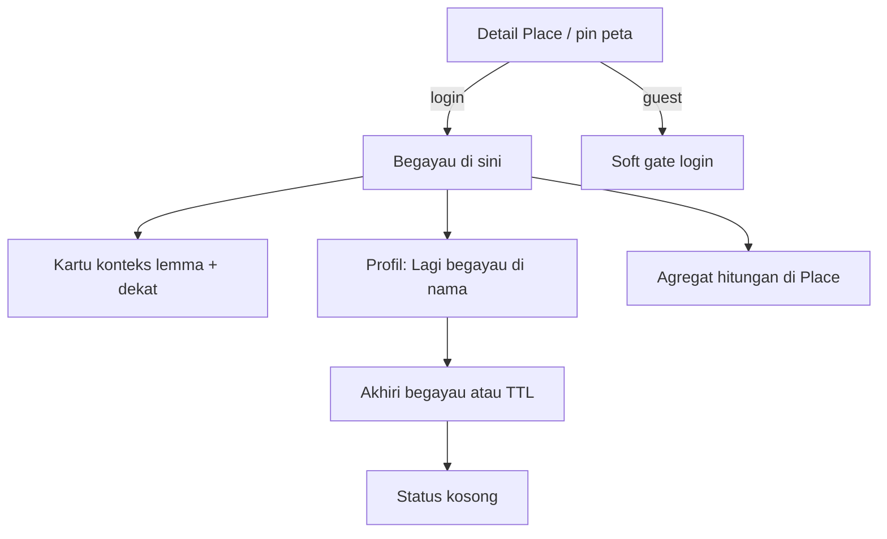

# BEGAYAU - Status jelajah sebagai konektor Eksplorasi

Dokumen backlog. **Belum diimplementasi.** Dieksekusi setelah fondasi
katalog Place (roadmap V2) cukup hidup. Brand dan konsep dikunci di
sini sampai diganti di file yang sama.

Sumber keputusan penamaan: lemma Sambas **Begayau** = jalan-jalan
([`csv/004-database sambasku:db_source.csv`](../../csv/004-database%20sambasku:db_source.csv)).

Dokumen terkait:

- [`docs/ROADMAP_PLAN.md`](../ROADMAP_PLAN.md) - V2 Place / POI, V5 UMKM, flywheel
- [`docs/PLAN_MOCK.md`](../PLAN_MOCK.md) - Place, Event, UmkmListing, thesis Explore
- [`docs/MONETIZE_PLAN.md`](../MONETIZE_PLAN.md) - impact-first, anti ads interruptive
- [`docs/GAMIFIKASI_CONCEPT.md`](../GAMIFIKASI_CONCEPT.md) - **Kehadiran** = streak kontribusi (bukan lokasi)
- Mobile Explore scaffold: `mobile/lib/features/explore/`

> Prompt implementasi nanti: tulis kontrak API + mobile (nomor urut
> mengikuti indeks docs saat itu). File ini sumber kebenaran sampai
> langkah itu selesai.

---

## Intent

Begayau membuat **Eksplorasi terasa hidup**: user menandai sedang
jelajah Sambas dan opsional mendarat di entity katalog (Place / UMKM
berlokasi / Event), lalu mendapat **konteks berguna di titik itu**
(lemma, dekat, tips) - bukan sekadar flex status.

Satu kalimat produk:

> Begayau = "saya sedang jelajah Sambas" + "di titik ini, SambasKu
> kasih apa yang perlu saya tahu / lakukan."

Tanpa sisi kedua (kartu konteks), fitur tinggal check-in kosong.

---

## Keputusan (tetap sampai diganti di file ini)

1. **Brand UI:** Begayau. Folder kode: `begayau`.
2. **Metafora:** status keluyuran / jelajah yang mendarat di entity
   Explore - **bukan** Pin Instagram, **bukan** feed "teman di mana".
3. **Bukan tab shell baru.** Entry: detail Place / peta / UMKM
   berlokasi / Event + baris status di profil sendiri.
4. **Target fase 1:** hanya entity katalog (terutama Place). Free-text
   lokasi dilarang.
5. **Satu begayau aktif per user** + TTL otomatis (default usulan:
   **6 jam**) + tombol Akhiri begayau.
6. **Privasi default:** agregat publik tanpa nama
   (`aggregate_only`). Bukan social network.
7. **GPS opsional** - self-declare dulu; nearby suggest belakangan.
   Tidak ada tracking kontinu di background.
8. **Guest** boleh lihat agregat + kartu konteks; **login** untuk
   mulai begayau.
9. **Beda tegas** dari Kehadiran (streak kontribusi), Kabar (pengumuman
   mitra), Bookmark (simpan kosakata), Eksplorasi (tab discovery).

### Nama yang ditolak sebagai brand utama

Bekabar, Semat, Singgah, Siau-layau, Ngerayau, Bejumpe, Besundang,
Bejakkut, Flex, Check-in, Presence, Status (sebagai nama produk).

**Siau-layau** (lalu-lalang) boleh dipakai sebagai copy suasana
sekunder, bukan nama modul.

---

## JTBD singkat

| Persona | Begayau membantu |
| ------- | ---------------- |
| Wisatawan / kerabat berkunjung | Mendarat di Place → frasa/lemma + dekat |
| Warga lokal | Status pribadi tanpa sosmed |
| Diaspora pulang kampung | Ranking Place dari sinyal nyata |
| Pelaku UMKM | Agregat "sering dibegayaui" di listing terklaim (F3) |
| Editor / mitra | Sinyal POI hidup vs mati |

---

## Tiga lapisan nilai (wajib bareng)

1. **User** - setelah begayau: **satu kartu konteks** (1-3 lemma/frasa,
   artikel terkait jika ada, 2-3 Place dekat). Bukan confetti check-in.
2. **Explore** - sinyal ranking "sering dibegayaui" / "sedang ramai";
   perawatan katalog (POI tanpa sinyal lama = kandidat rawat).
3. **UMKM / mitra (F3)** - agregat dampak, bukan lead chat. Highlight
   berbayar tidak boleh memalsukan ranking organik begayau.

### Flywheel kecil

```text
Katalog Explore (Place / UMKM / Event)
        ↓
User begayau di titik X
        ↓
Kartu konteks (lemma, dekat, tips)
        ↓
Lookup / bookmark / share / usul perbaikan Place
        ↓
Kamus + katalog makin kaya
        ↓
Sinyal ranking menghidupkan Explore
```

---

## Alur F1 (MVP berguna)



---

## Copy UI

| Elemen | Copy |
| ------ | ---- |
| Status profil (ada target) | Lagi begayau di {nama} |
| Status profil (tanpa target) | Lagi begayau di Sambas |
| CTA Place / UMKM lokasi | Begayau di sini |
| CTA Event | Begayau ke acara ini |
| Tombol selesai | Akhiri begayau |
| Empty profil | Belum begayau. Temukan tempat di Eksplorasi. |
| Agregat di entity | {n} begayau hari ini (hitungan saja) |
| Soft gate tamu | Masuk untuk mulai begayau |

Hindari em/en dash di semua copy. Hindari "check-in", "flex", "live
location".

---

## Model data (usulan)

```text
begayaus:
  id
  user_id
  target_type   null | place | umkm | event
  target_id     null
  started_at
  ended_at      null = aktif
  visibility    private | aggregate_only   # default aggregate_only
  source        manual | nearby_suggest    # nearby = F2
```

Derived (boleh belakangan):

- agregat harian/mingguan per Place untuk ranking
- kartu konteks = Place → `related_word_ids` + nearby Place

Aturan bisnis F1:

- max satu baris aktif per `user_id` (`ended_at IS NULL`)
- mulai begayau baru mengakhiri yang aktif (atau tolak dengan pesan jelas)
- TTL job / query: aktif lebih lama dari 6 jam dianggap berakhir

Nama tabel final (`begayaus` vs `explore_begayaus`) diputus saat spek API.

---

## Fase eksekusi

### F0 - Prasyarat (bukan Begayau sendiri)

Tanpa ini MVP kosong:

- [ ] Entity **Place / POI** live di Explore + peta (roadmap V2)
- [ ] Detail Place: nama, deskripsi singkat, koordinat, lemma terkait
- [ ] Event analytics Explore sudah ada pola (`explore_category_tap`,
      `map_open`) - siapkan namespace `begayau_*`

### F1 - MVP berguna

- [ ] API: start / end / get my active begayau
- [ ] API: agregat count per Place (publik)
- [ ] Mobile: CTA di detail Place + status di profil
- [ ] Mobile: kartu konteks pasca-start (lemma + 2 Place dekat)
- [ ] Guest soft gate; login required untuk start
- [ ] TTL + Akhiri begayau
- [ ] Analytics: `begayau_start`, `begayau_end`, `begayau_context_open`

**Gate keluar F1:** dari `begayau_start`, cukup banyak sesi yang
membuka ≥1 item konteks/lemma di sesi yang sama. Jika hampir nol →
perkuat kartu konteks, jangan dorong vanity CTA.

### F2 - Konektor Explore kuat

- [ ] Target UMKM berlokasi + Event
- [ ] Ranking Explore "sering dibegayaui minggu ini"
- [ ] Jejak pribadi (riwayat) di profil - bukan feed publik
- [ ] Saran "lanjut begayau ke ..." (dekat + kategori)
- [ ] Soft prompt perbaikan data Place ("jam buka masih benar?")
- [ ] Opsional: nearby suggest (GPS sekali, bukan background)

### F3 - Nilai mitra / UMKM

- [ ] Agregat begayau untuk pemilik listing terklaim
- [ ] Metrik kampanye event ("begayau di acara")
- [ ] Editorial paket akhir pekan memakai sinyal begayau nyata
- [ ] Tetap: highlight tidak memalsukan ranking organik

---

## Anti-goal / later (jangan dulu)

| Jangan | Alasan |
| ------ | ------ |
| Live map semua user / presence sosial | Anti-goal social network |
| Feed "teman sedang begayau" | Privasi + beban moderasi |
| Streak begayau vs Kehadiran kontribusi | Bentrok makna gamifikasi |
| Leaderboard publik paling sering begayau | Vanity, bukan living culture |
| Wajib GPS background | Privasi; peta Explore bukan tracking |
| Review bintang 1-5 ala Google | Beban moderasi; merusak trust |
| Free-text lokasi tanpa katalog | Memecah pivot ke Explore |
| Tab shell baru khusus Begayau | Shell sudah punya Eksplorasi |

---

## Analytics & metrik

| Event / metrik | Menandakan |
| -------------- | ---------- |
| `begayau_start` | Aktivasi status |
| `begayau_end` | Selesai manual / TTL |
| `begayau_context_open` | Kartu konteks berguna |
| start → context_open rate | Bukan gimmick |
| % begayau dengan `target_id` | Pivot entity sehat |
| POI dengan ≥N begayau / 30 hari | Katalog hidup |
| D7 retensi: pernah vs tidak begayau | Nilai retensi |
| (F3) pemilik listing buka agregat | Nilai mitra |

---

## Prinsip implementasi

1. Kontekstual > deklaratif - hadiah utama = kartu konteks.
2. Satu pekerjaan per permukaan.
3. Kamus tetap trust center - Begayau menaut lemma, tidak mengganti
   makna.
4. Impact-first - sinyal organik tidak dijual sebagai arti kata.
5. Tipografi: hyphen ASCII `-` saja (tanpa em/en dash).

---

## Urutan kerja saat eksekusi (ringkas)

1. Pastikan F0 Place cukup (detail + lemma terkait + pin peta).
2. Spek API `begayau` + migrasi tabel.
3. Spek mobile: CTA Place, profil status, kartu konteks.
4. Instrumentasi analytics.
5. Soft launch F1 → ukur start→context_open → baru F2.

---

## Keputusan terbuka (tidak memblokir backlog)

| Topik | Opsi | Default sementara |
| ----- | ---- | ----------------- |
| TTL | 4 / 6 / 12 jam | 6 jam |
| Nama tabel | `begayaus` / `explore_begayaus` | `begayaus` |
| Nearby GPS | F2 atau later | F2 opsional |
| Begayau tanpa target ("di Sambas") | Ya / tidak di F1 | Ya |
