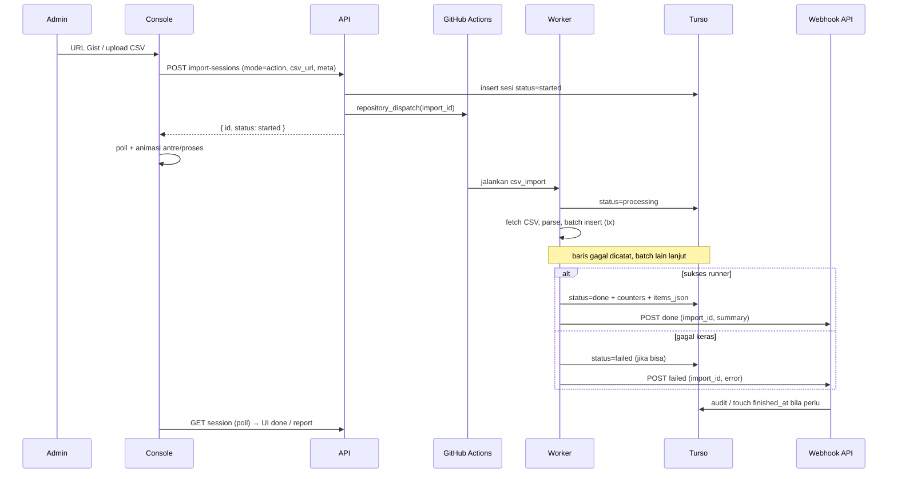

# CSV_IMPORT_WITH_ACTION - Impor massal via GitHub Actions worker

Dokumen backlog. **Belum diimplementasi.** Pipeline ETL impor CSV di
luar Cloudflare Workers, dijalankan oleh repo **worker** lewat GitHub
Actions, insert langsung ke Turso, lalu callback ke API lewat webhook.

Impor CSV console hari ini (parse di browser → `POST` per kata → simpan
sesi `word_import_sessions`) **tetap hidup** untuk batch kecil /
preview. Mode Action ini untuk batch besar yang kena budget subrequest
Workers, rate limit, dan timeout browser.

Lihat juga:

- Sesi impor existing: `word_import_sessions`, entity
  `WordImportSessionStatus` (`running` | `completed` | `cancelled` |
  `failed`), console `import-words-drawer.tsx` + riwayat
- User sistem atribusi: `CSV_IMPORTER_USER_ID` /
  `importir-csv@sambasku.com`
- Format CSV: `console/.../parse-import-csv.ts` (header
  `kata,terjemahan,penjelasan_arti,contoh`)
- Pola submodule: [`TELEGRAM_BOT.md`](./TELEGRAM_BOT.md), README root
- Cap Workers: [`done/FAILOVER.md`](./done/FAILOVER.md)

> Prompt implementasi nanti: pecah ke
> `docs/api/NN-api-csv-import-action.md` + kontrak admin console +
> README repo `worker`. File ini sumber kebenaran sampai langkah itu.

---

## Intent

Admin mengisi kamus dari CSV besar tanpa menahan tab browser dan tanpa
menabrak batas Workers. Alur:

1. Admin pilih sumber CSV (URL Gist / upload file).
2. Backend buat sesi impor + kirim **hanya `import_id`** ke GitHub
   Action (payload kecil, cepat).
3. Worker fetch CSV, parse, mass-insert ke Turso dalam transaksi per
   batch.
4. Baris gagal **tidak menghentikan** job; dicatat untuk revisi di
   panel riwayat lalu submit ulang.
5. Terminal state dilapor ke webhook API; UI console sadar status +
   animasi progress.

---

## Positioning

| Mode Action (baru) | Mode browser (existing) |
| ------------------ | ----------------------- |
| Batch besar (ratusan–ribuan lemma) | Preview / batch kecil |
| Insert langsung Turso dari runner | Lewat API `CreateWord` / import endpoint |
| Status server-driven + poll UI | Progress lokal di drawer |
| Gagal per-baris → report + resubmit | Retry per kata di client |
| Repo `worker` + org secrets | Console + API saja |

Bukan pengganti klaim atribusi (`claim` ke user nyata) dan bukan
moderasi konten baru.

---

## Bentuk repo

Repo Git sendiri bernama **`worker`** (sejajar pola submodule
`api/`, `console/`, …). Boleh di-link sebagai submodule monorepo
nanti; deploy & secret terpisah.

```text
console / admin
   │  buat sesi + trigger
   ▼
api/   (buat sesi, generate/validasi webhook, repository_dispatch)
   │  payload: { import_id }
   ▼
GitHub Actions (org)  ──secrets──► TURSO_*, WEBHOOK_TOKEN, …
   │
   ▼
worker/  (ETL)
   ├── scripts/csv_import/     parse + mass insert + report
   ├── lib/turso/              client + transaksi batch
   ├── lib/webhook/            callback status / error
   └── .github/workflows/
         csv-import.yml        repository_dispatch | workflow_dispatch
   │
   ├─► Turso (insert kata + update status sesi)
   └─► POST webhook API (progress terminal + error ringkas)
```

**Keputusan arsitektur:**

1. Worker **boleh** tulis langsung ke Turso (data kata + update status
   sesi). Ini memang pipeline ETL, bukan client API biasa.
2. Webhook ke API wajib untuk state terminal (`done` / `failed` /
   partial-complete) supaya API bisa audit, invalidate cache, dan
   mendorong UI (poll lebih agresif / event).
3. Worker **tidak** mengimpor use case Hono dari `api`; logika insert
   diduplikasi atau diekstrak ke paket bersama belakangan. V1: script
   di `worker` yang mengikuti skema Drizzle / aturan domain yang sama
   (lemma unik, makna, atribusi `CSV_IMPORTER_USER_ID`, sitasi support).

---

## Status sesi (mesin state)

Status baru untuk mode Action (map ke kolom `word_import_sessions.status`
atau kolom tambahan `pipeline` - keputusan implementasi):

| Status | Arti | Siapa menulis |
| ------ | ---- | ------------- |
| `started` | Sesi dibuat, Action belum / baru di-dispatch | API |
| `processing` | Runner jalan, sedang parse/insert | Worker (Turso) |
| `done` | Job selesai; boleh ada baris gagal di report | Worker + webhook |
| `failed` | Job gagal keras (tidak bisa lanjut): auth Turso, CSV hilang, panic | Worker + webhook |
| `cancelled` | Admin batalkan sebelum/saat jalan (best-effort) | API (+ signal ke Action bila ada) |

Mapping ke enum lama (kompatibilitas riwayat):

| Baru | Lama (alias UI) |
| ---- | --------------- |
| `started` | (baru; UI “Antre”) |
| `processing` | ~ `running` |
| `done` | ~ `completed` |
| `failed` | `failed` |
| `cancelled` | `cancelled` |

**Partial success:** status tetap `done` jika runner selesai normal.
Perbedaan “semua sukses” vs “ada baris gagal” dibaca dari
`invalid_count` / daftar item `outcome=invalid` (atau outcome baru
`failed_insert`), bukan status sesi terpisah. Satu status terminal
`done` + chip “N gagal” di UI lebih sederhana daripada status
`partial` terpisah (yang membingungkan filter dan klaim atribusi).

---

## Input sumber CSV

Sama seperti impor CSV existing untuk metadata (atribusi, support
sitasi, label sumber). Yang berbeda hanya **cara file masuk**:

### 1. URL CSV di Gist (atau raw URL HTTPS)

- Admin tempel URL raw Gist / raw GitHub / URL HTTPS lain yang
  mengembalikan `text/csv` atau plain text.
- Backend validasi skema URL (HTTPS saja), simpan di sesi
  (`source_url` / `csv_url`), **tidak** mengunduh seluruh file di
  path request sync (cukup HEAD/GET kecil atau defer ke worker).
- Worker fetch URL saat `processing`.

### 2. Upload raw CSV dari console

- Admin upload file di drawer (sama UX dropzone existing).
- Console **tidak** parse-insert per kata untuk mode Action.
- App upload ke penyimpanan file sementara:
  - **V1 preferensi:** GitHub Gist privat/org via token bot (secret),
    atau object storage (R2/S3) bila Gist terlalu sempit.
  - Respons: URL raw yang disimpan di sesi.
- Setelah URL siap → sama seperti alur (1): buat sesi `started` +
  dispatch Action dengan `import_id`.

### 3. Sisanya sama

- Templat kolom: `kata,terjemahan,penjelasan_arti,contoh` (+ alias
  yang sudah diterima `parse-import-csv`).
- Field atribusi / support (nama, tipe, alamat, judul, desc).
- Default `attributed_to` = Pengimpor Data CSV; klaim nanti dari
  riwayat (fitur existing).
- Riwayat, unduh laporan CSV, detail item per lemma.

---

## Alur end-to-end



### Payload trigger Action

Minimal:

```json
{
  "event_type": "csv_import",
  "client_payload": {
    "import_id": "01J…"
  }
}
```

Opsional: `environment` (`staging` | `production`) bila satu workflow
melayani keduanya lewat secret berbeda / environment GitHub.

Worker lalu:

1. `GET` metadata sesi dari Turso (atau endpoint internal API yang
   dilindungi token webhook) → ambil `csv_url`, atribusi, support.
2. Fetch CSV → parse → insert.
3. Update sesi + webhook.

**Jangan** kirim isi CSV atau token Turso di `client_payload`.

---

## Secret organisasi

Disimpan di **GitHub Organization secrets** (bukan di repo aplikasi
publik):

| Secret | Dipakai untuk |
| ------ | ------------- |
| `CSV_IMPORT_WEBHOOK_TOKEN` | Header auth callback worker → API |
| `TURSO_DATABASE_URL` | (per env) koneksi libsql |
| `TURSO_AUTH_TOKEN` | (per env) token write |
| `GH_DISPATCH_TOKEN` atau App | API memicu `repository_dispatch` |
| `GIST_TOKEN` / storage | Upload CSV dari console (jika lewat Gist) |

Token webhook **di-generate / dirotasi dari backend** (atau runbook
admin), lalu disalin ke org secret. API memvalidasi
`Authorization: Bearer <token>` (atau header `X-Webhook-Token`) pada
endpoint callback.

Rotasi: dua token overlapping (current + previous) selama jendela
pendek agar job in-flight tidak 401.

---

## Webhook API (kontrak ringkas)

Endpoint baru (nama final di docs API nanti), contoh:

- `POST /api/v1/internal/import-sessions/:id/webhook`

Auth: token org secret. Rate limit ketat + IP allowlist opsional
(GitHub Actions IP ranges berubah; prefer token kuat dulu).

Body (contoh):

```json
{
  "event": "processing" | "progress" | "done" | "failed",
  "import_id": "01J…",
  "run_id": "github-run-123",
  "message": "opsional, human readable",
  "error": { "code": "CSV_FETCH_FAILED", "detail": "…" },
  "summary": {
    "total": 1200,
    "created_count": 1100,
    "duplicates_count": 50,
    "meanings_added_count": 40,
    "invalid_count": 10
  },
  "failed_rows": [
    {
      "row_number": 42,
      "lemma": "…",
      "reason": "lemma kosong / FK kelas kata / unique conflict tak terduga"
    }
  ]
}
```

Catatan:

- Update status `processing` boleh langsung Turso **atau** lewat
  webhook `processing` (pilih satu sumber kebenaran di implementasi;
  dokumentasikan). Rekomendasi V1: **Turso dulu** agar UI poll melihat
  progress meski webhook lambat; webhook wajib untuk `done`/`failed`.
- `failed_rows` bisa ringkas di webhook; detail penuh tetap di
  `items_json` sesi (batas ukuran - lihat edge case).

---

## Mass insert + transaksi

1. Parse seluruh CSV di runner (streaming jika file besar).
2. Group per lemma (sama aturan console: satu baris = satu makna).
3. Insert dalam **batch** (mis. 25–100 lemma / transaksi), bukan satu
   transaksi untuk seluruh file (hindari lock lama + timeout Turso).
4. Per batch:
   - `BEGIN`
   - insert kata + anak (makna, contoh, sitasi) sesuai aturan domain
   - jika satu lemma gagal validasi/domain: **rollback lemma itu saja**
     (savepoint) atau skip lemma + catat; batch lain commit
   - `COMMIT` batch yang bersih
5. Jangan biarkan transaksi terbuka lintas fetch jaringan / sleep.
6. Idempotensi: `import_id` + fingerprint lemma/makna; re-run Action
   untuk sesi yang sudah `done` harus no-op atau ditolak (lihat edge
   case).

Baris / lemma gagal:

- Tetap lanjut batch berikutnya.
- Catat di `items` dengan `outcome` yang bisa difilter di UI
  (`invalid` atau `failed_insert`) + `message` penyebab.
- Naikkan `invalid_count`.
- Setelah job: status `done` jika runner selesai; admin buka riwayat →
  filter gagal → **revisi** → **submit ulang** (job Action baru hanya
  untuk subset, atau mode browser untuk sedikit baris).

---

## UI console (aware + animasi)

1. Drawer impor: tab/mode **“Impor besar (Action)”** vs **“Impor cepat
   (browser)”**.
2. Setelah submit mode Action: tutup wizard berat; arahkan ke detail
   sesi atau panel progress.
3. Poll `GET /import-sessions/:id` (interval 2–5 dtk saat
   `started`/`processing`; stop saat terminal).
4. Animasi:
   - `started`: pulse / skeleton “Menunggu runner…”
   - `processing`: progress indeterminate atau % jika worker kirim
     `progress` (opsional V1.1: `processed/total` di kolom sesi)
   - `done`: confetti ringan atau check morph; tampilkan ringkasan +
     CTA “Lihat baris gagal” bila `invalid_count > 0`
   - `failed`: shake / banner error + `message` dari webhook
5. Riwayat list: badge status baru; filter “Ada gagal”.
6. Detail: tabel item; aksi **Revisi & kirim ulang** pada baris gagal
   (edit sel → buat sesi anak / payload resubmit).

---

## Resubmit baris gagal

1. Dari detail riwayat, admin pilih baris `invalid` / `failed_insert`.
2. Editor inline atau sheet kecil (lemma, terjemahan, arti, contoh).
3. Submit:
   - **V1:** generate CSV mini (Gist/upload) + sesi Action baru dengan
     `parent_import_id` (opsional, untuk jejak).
   - **Alternatif:** mode browser import hanya subset (cukup jika N
     kecil).
4. Sesi induk tidak berubah status; sesi anak punya report sendiri.
5. Jangan double-insert lemma yang sudah `created` di induk tanpa
   konfirmasi (default: treat sebagai `meanings_added` / skip sesuai
   aturan existing).

---

## Keamanan & otorisasi

- Hanya role yang boleh impor kata hari ini yang boleh trigger Action.
- `repository_dispatch` memakai GitHub App / PAT fine-grained terbatas
  repo `worker` + event dispatch.
- Webhook token tidak pernah diekspos ke console browser.
- CSV di Gist: prefer private; URL raw tidak dilog penuh di audit
  publik.
- Audit log API: siapa trigger, `import_id`, env, ringkasan terminal.
- Worker Turso token: least privilege per environment; jangan campur
  staging/prod di satu secret tanpa environment GitHub.

---

## Edge cases

### Sumber & file

| Kasus | Perilaku |
| ----- | -------- |
| URL non-HTTPS / host diblokir | Tolak di API saat buat sesi |
| Gist 404 / private tanpa token | `failed`, webhook `CSV_FETCH_FAILED` |
| File kosong / tanpa header dikenali | `failed` cepat setelah parse |
| Encoding selain UTF-8 (mis. Windows-1252) | Coba deteksi BOM; jika gagal catat error jelas |
| Delimiter `;` / tab | Ikuti deteksi existing `parse-import-csv` |
| File > batas (mis. 20 MB / 10k baris) | Tolak di upload API atau gagalkan worker dengan pesan kuota |
| CSV dengan lemma duplikat antar baris | Digabung jadi multi-makna (aturan existing) |
| Karakter kontrol / formula injection (`=CMD`) | Sanitize saat tampil di console; simpan teks aman |

### Sesi & concurrency

| Kasus | Perilaku |
| ----- | -------- |
| Dispatch dobel untuk `import_id` sama | Runner kedua no-op jika status sudah `processing`/`done` (lock optimistik di Turso) |
| Dua admin impor bersamaan | Diizinkan; sesi terpisah; waspadai unik lemma (satu menang, satu `skipped` / meanings) |
| Action timeout GitHub (job panjang) | Batch + checkpoint: kolom `cursor_row` opsional V1.1; V1 batasi ukuran + gagal dengan `failed` + report progress terakhir |
| Runner kill di tengah transaksi | Transaksi batch rollback; sesi residual `processing` → watchdog API (cron) mark `failed` setelah TTL (mis. 2 jam) |
| Admin cancel saat `processing` | Best-effort: flag `cancel_requested`; worker cek antar batch; tidak bisa rollback batch yang sudah commit |

### Data & domain

| Kasus | Perilaku |
| ----- | -------- |
| Lemma sudah ada | `skipped` atau `meanings_added` (sama existing) |
| Referensi kelas kata / bahasa hilang | Pakai default seed (seperti impor console) atau invalid dengan pesan |
| Partial batch: 1 lemma bad, 99 good | 99 commit; 1 di report; lanjut |
| `items_json` melebihi batas praktis | Simpan ringkasan + upload artifact report ke storage/Gist; DB hanya counters + sample N gagal |
| Klaim atribusi saat masih `processing` | Tolak (`Conflict`) sampai `done` |
| Klaim saat ada baris gagal | Tetap boleh klaim lemma yang `created` / `meanings_added` saja |

### Webhook & secret

| Kasus | Perilaku |
| ----- | -------- |
| Webhook 5xx / timeout | Worker retry eksponensial (mis. 3×); status Turso sudah final tetap sah; API reconcile via poll admin |
| Token salah | 401; alert ops; jangan update sesi dari request palsu |
| Event `done` dua kali | Idempotent upsert summary |
| Clock skew `finished_at` | Pakai waktu server API saat webhook, atau waktu worker yang sudah ditulis Turso |

### UI

| Kasus | Perilaku |
| ----- | -------- |
| User tutup tab saat `started` | Job tetap jalan; riwayat menampilkan status |
| Poll gagal jaringan | Banner “menyambung ulang”; jangan anggap job gagal |
| `done` dengan `invalid_count = total` | Masih `done`; CTA revisi menonjol; jangan confetti berlebihan |
| Mode browser vs Action salah pilih | Copy di drawer menjelaskan batas ukuran & estimasi waktu |

### Ops

| Kasus | Perilaku |
| ----- | -------- |
| Secret Turso staging dipakai di workflow prod | Environment GitHub terpisah + cek `environment` di payload |
| Repo `worker` di-fork PR | Workflow `repository_dispatch` hanya dari repo kanonis; jangan jalankan ETL dari fork |
| Kena rate limit Turso | Backoff antar batch; catat di log Action; jangan spam webhook progress |

---

## Keputusan (tetap sampai diganti di file ini)

1. Repo terpisah **`worker`** + GitHub Actions; trigger utama
   `repository_dispatch` dengan **`import_id` saja**.
2. Sumber CSV: **URL Gist/raw** atau **upload → URL** (Gist/R2).
3. Status: **`started` → `processing` → `done` | `failed` |
   `cancelled`**.
4. Insert: **mass insert ber-batch + transaksi/savepoint**; gagal per
   baris tidak menghentikan job.
5. Terminal: update Turso + **webhook** ber-token org secret.
6. UI: poll + animasi; report gagal → revisi → resubmit.
7. Impor browser existing **tetap** untuk batch kecil / preview.
8. Atribusi default Pengimpor Data CSV; klaim existing setelah `done`.

Ditolak untuk V1:

| Opsi | Alasan |
| ---- | ------ |
| Kirim seluruh CSV di `client_payload` | Batas ukuran event + rahasia di log Actions |
| Worker memanggil CreateWord per lemma lewat API publik | Mengalahkan tujuan (Workers/rate limit) |
| Satu transaksi untuk seluruh file | Timeout / lock; sulit partial report |
| Status `partial` terpisah | Cukup `done` + `invalid_count` |
| Parse Excel `.xlsx` | Menyusul; CSV dulu |
| Realtime WebSocket progress | Poll cukup; websocket belakangan |

---

## Pekerjaan pecahan (saat implementasi)

1. **API** - kolom/sesi mode Action (`csv_url`, status baru), endpoint
   buat sesi + trigger dispatch, webhook internal, watchdog TTL,
   audit, Bruno + docs.
2. **worker** - scaffold repo, workflow, script `csv_import`, client
   Turso, webhook client, tes parse + batch di CI (Turso test / mock).
3. **console** - mode drawer, upload→URL, progress animasi, filter
   gagal, revisi + resubmit.
4. **Secrets / runbook** - generate webhook token, org secrets per
   env, rotasi, siapa boleh dispatch.
5. **Docs** - kontrak API + README worker; pindahkan file ini ke
   `backlogs/done/` setelah ship.

---

## Estimasi kasar

| Area | Hari |
| ---- | ---- |
| API sesi + webhook + dispatch | 1.5–2 |
| Repo worker + script ETL + CI | 2–3 |
| Console UX mode Action + animasi + resubmit | 1.5–2 |
| Secrets/runbook + harding edge case | 0.5–1 |

Total sekitar **5.5–8 hari** tergantung pilihan storage upload (Gist vs
R2) dan seberapa dekat logika insert worker dengan domain `CreateWord`.
