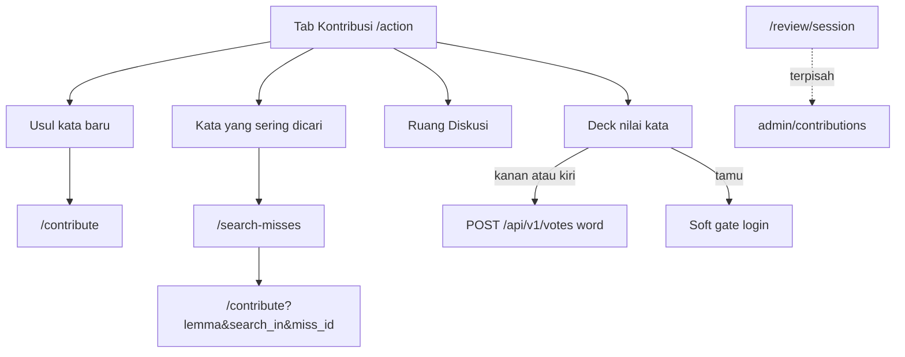

# KONTRIBUSI_VOTE_DECK - Menu search-miss + deck nilai kata

Catatan kontrak (2026-09-25). Redesain tab **Kontribusi** (`/action`):
antrian search-miss pindah ke halaman/menu tersendiri; area bawah
menjadi stack swipe vote untuk kata terbit yang user belum pernah
nilai.

Estimasi implementasi setelah kontrak disalin: **3-3.5 hari**
(API ~1, mobile ~1.5-2, docs 0.5).

> Prompt implementasi: tulis `docs/api/34-api-vote-deck.md`,
> `docs/mobile/22-mobile-kontribusi-vote-deck.md`. File ini sumber
> kebenaran sampai langkah itu selesai; setelah implementasi, keduanya
> jadi kontrak hidup.

---

## Intent

Tab Kontribusi punya dua pekerjaan yang jelas:

1. **Usul** - user menambah kata (form kosong + antrian “sering dicari”).
2. **Nilai** - semua user login membantu kualitas kamus dengan menilai
   kata terbit yang belum pernah mereka vote.

Stack swipe **bukan** moderasi. Sesi verifikator (`/review/session`,
approve/tolak) tetap terpisah.

---

## Situasi sekarang

- Tab: `activity_page.dart` - tile **Usul kata baru** + **Bantuan
  Terjemahan**, lalu list inline search-miss (atau copy empty).
- Vote: `POST /api/v1/votes` (target `word`), UI tombol
  “Upvote/Downvote”, prompt detail “Entri ini membantu?”.
- Belum ada feed “kata yang belum pernah di-vote user”.
- Swipe verifikator: `ReviewSwipeCard` - pola gesture bisa diadaptasi;
  widget **tidak** digabung dengan review.

---

## Keputusan (tetap sampai diganti di file ini)

1. **Menu baru** di bawah **Usul kata baru**: **Kata yang sering
   dicari** → halaman list search-miss.
2. Urutan tile di tab: Usul kata baru → **Kata yang sering dicari** →
   Ruang Diskusi.
3. **Deck bawah tab**: kartu kata terbit (`entity_type = word`) yang
   **user belum punya baris vote** untuk kata itu.
4. Gesture: kanan = positif (**Masuk akal**), kiri = negatif
   (**Kurang pas**). Tombol footer mirror gesture.
5. Vote tetap **login-only**. Tamu: CTA soft gate + kartu sample
   read-only dari `GET /words/latest` tanpa aksi vote.
6. Setelah vote, kartu hilang dari deck user itu.
7. Count vote **disembunyikan di UI deck** (boleh ada di response API)
   agar tidak biasing.
8. Endpoint baru: `GET /api/v1/votes/deck`. Aksi reuse
   `POST /api/v1/votes`.

Ditolak untuk V1:

| Opsi | Alasan |
| ---- | ------ |
| Vote meaning/example di deck | Fokus sinyal kualitas entri kata dulu |
| Gabung UI dengan sesi tinjau | Beda role, beda API, beda makna gesture |
| Tampilkan skor di kartu | Biasing keputusan user |
| Brigading / anti-abuse baru | Rate limit vote yang ada cukup |

---

## Alur

---

## Copy (manusiawi)

Hindari “Upvote/Downvote” di permukaan deck.

| Elemen | Copy |
| ------ | ---- |
| Judul section deck | Bantu nilai kamus |
| Subtitle | Geser kartu - apakah arti kata ini masuk akal buat kamu? |
| Swipe kanan / tombol positif | Masuk akal |
| Swipe kiri / tombol negatif | Kurang pas |
| Hint footer | Geser kanan kalau masuk akal, kiri kalau kurang pas - atau pakai tombol |
| Toast sukses | Terima kasih - penilaianmu tersimpan |
| Empty deck | Kamu sudah menilai semua kata di antrean. Terima kasih membantu warga lain. |
| Error muat | Gagal memuat antrean penilaian. Tarik untuk coba lagi. |
| Gate tamu | Masuk dulu untuk menilai kata |
| Tile menu search-miss | Kata yang sering dicari / Pilih kata yang warga cari tapi belum ada |
| Empty halaman search-miss | Belum ada antrian dari pencarian warga. Coba lagi nanti, atau usul kata baru dari menu di atas. |

Kartu: lemma, padanan/sense ringkas, kelas kata jika mudah didapat.
Tap detail ke `/words/:id` opsional V1 (boleh ditunda).

---

## Kontrak API (ringkas)

Lihat [`../api/34-api-vote-deck.md`](../api/34-api-vote-deck.md).

- `GET /api/v1/votes/deck?limit=&cursor=` - auth wajib.
- Filter: published, not deleted, feed-safe labels, **NOT EXISTS** vote
  user untuk `(word, word_id)`.
- Urutan: total vote global rendah dulu, lalu `approved_at` / id.
- Item mirip `/words/latest` + optional counts.
- Vote: `POST /api/v1/votes` `{ target_type: word, target_id, value }`.

---

## Kontrak mobile (ringkas)

Lihat [`../mobile/22-mobile-kontribusi-vote-deck.md`](../mobile/22-mobile-kontribusi-vote-deck.md).

- Refactor `ActivityPage`: tile baru, list miss keluar, deck di bawah.
- Halaman `/search-misses`.
- Widget swipe adaptasi pola `ReviewSwipeCard` (state terpisah).
- Analytics: `vote_deck_view`, `vote_deck_swipe`.

---

## Referensi

- [`NEXT.md`](NEXT.md) - peta jalan
- [`../api/08-api-upvote-downvote.md`](../api/08-api-upvote-downvote.md)
- [`../api/26-api-my-votes.md`](../api/26-api-my-votes.md)
- Review swipe: `mobile/lib/features/review/presentation/widgets/review_swipe_card.dart`
