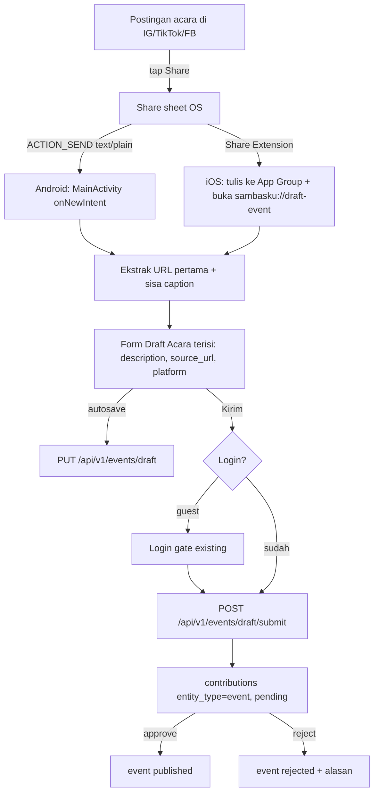

# PUT_DRAFT_EVENT - Share dari Instagram/TikTok/Facebook jadi draft acara

Catatan kontrak (2026-09-21), **sebelum** ditulis ke `docs/api/` dan
`docs/mobile/`. Fitur baru total: aplikasi belum punya entitas acara
(event) sama sekali.

Estimasi implementasi setelah kontrak disalin: **3-4 hari** (separuhnya
Share Extension iOS + form mobile).

> Prompt implementasi nanti:
> tulis `docs/api/25-api-draft-event.md` dan
> `docs/mobile/14-mobile-share-in-draft-event.md`, plus delta doc admin
> antrean kontribusi. File ini sumber kebenaran sampai langkah itu.

---

## Intent

User melihat postingan acara (event) di Instagram / TikTok / Facebook,
tap **Share**, memilih **SambasKu** dari daftar aplikasi share OS.
Aplikasi terbuka langsung di **form Draft Acara** yang sudah terisi
otomatis dari share: caption jadi deskripsi, URL postingan jadi sumber.
User hanya melengkapi sedikit field (nama acara, tanggal, lokasi), lalu
simpan draft / kirim ke antrean moderasi.

Pertanyaan yang memicu backlog ini: *apakah aplikasi kita bisa masuk
listing aplikasi "shareable" di share sheet OS?* **Jawabannya: bisa**,
tanpa kerja sama khusus dengan Instagram/TikTok/Facebook:

| Platform | Mekanisme | Upaya |
| -------- | --------- | ----- |
| Android | `intent-filter` `ACTION_SEND` `text/plain` di `AndroidManifest.xml` | Kecil, edit manifest + handler |
| iOS | **Share Extension** (target Xcode native baru) + App Group + custom URL scheme | Sedang, kode Swift + setup project |

Ketiga aplikasi sosial itu mengirim postingan sebagai **teks**
(caption + URL, `text/plain`) ke share sheet. Satu jalur parsing teks
menutup semuanya. Bonus: aplikasi lain yang share teks (WhatsApp, X,
browser) ikut masuk tanpa kerja tambahan.

---

## Situasi sekarang

- Tidak ada modul `event` di API (21 modul ada, none acara) dan tidak
  ada fitur event di mobile.
- `AndroidManifest.xml`: `MainActivity` hanya punya intent-filter
  `MAIN`/`LAUNCHER`. `launchMode="singleTop"` sudah benar untuk
  menerima share saat app terbuka (`onNewIntent`, bukan activity baru).
- iOS: belum ada custom URL scheme di `Info.plist`, belum ada App
  Group / file `.entitlements`. Preseden kode native Swift sudah ada
  (`ShareVideoComposer.swift`), jadi menambah target extension bukan
  hal asing.
- Mobile: `share_plus` terpasang (arah keluar), **belum ada** paket
  penerima share.
- `contributions` sudah polymorphic (`entity_type varchar(50)`) dan
  approval gate Section 22 (`draft | pending_review | published |
  rejected`) berlaku untuk "jenis konten lain yang menyusul". Event
  tinggal mendaftarkan `entity_type = 'event'`.
- Auth lengkap (login + Google), guest masih bisa browsing. Draft
  per-user butuh akun.

---

## Keputusan (tetap sampai diganti di file ini)

1. **V1 menerima teks saja** (`text/plain`). Caption + URL. Share
   gambar/video/instastory dari aplikasi lain ditunda.
2. **Draft disimpan di server, satu slot per user.**
   `PUT /api/v1/events/draft` upsert (kalau ada baris `status='draft'`
   milik user, update; kalau tidak, insert). PUT = replace isi penuh,
   semua field opsional - form autosave selalu kirim seluruh state.
   Share baru menimpa isi draft lama; tidak ada UI kelola banyak draft
   dan tidak perlu endpoint DELETE.
3. **Autofill dari share**: URL http(s) **pertama** jadi
   `source_url` (verbatim, jangan strip query param - Instagram butuh
   `igsh` dsb. untuk resolve post). Sisa teks (URL dibuang, trim)
   jadi `description`. `source_platform` dideteksi dari host:
   `instagram` / `tiktok` / `facebook` / `lainnya`.
4. **Tidak ada ekstraksi pintar** (AI/regex nama acara, tanggal,
   lokasi dari caption) di V1. Field itu user isi sendiri. Predictable
   beats clever; enrich menyusul sebagai delta.
5. **Submit masuk approval gate existing**: baris `contributions`
   `entity_type='event'`, `status='pending'`. Contributor → event
   `pending_review`; admin/editor/root/reviewer → langsung
   `published` + `is_verified` (role matrix Section 22).
6. **Login wajib** untuk PUT/GET/submit. Guest yang share-in tetap
   bisa lihat form terisi (state lokal); tombol Kirim memicu login
   gate yang sudah ada, setelah login lanjut PUT + submit.
7. **Paket mobile `receive_sharing_intent`** untuk Android intent +
   handoff iOS dari Share Extension. Extension iOS = target native
   `ShareExtension` (Swift, non-Flutter) yang menulis teks ke App
   Group lalu membuka app via scheme `sambasku://draft-event`.
8. **Skema tabel `events`** mengikuti aturan rumah: ULID `varchar(26)`,
   soft delete, `created_by`/`updated_by`, kolom status +
   `is_verified` ala Section 22. Satu draft aktif dijamin **partial
   unique index** `(created_by) WHERE status='draft' AND deleted_at IS
   NULL`.
9. **Tanpa env baru** dan tanpa provider eksternal.
10. **Tidak ada halaman publik daftar/detail acara di backlog ini.**
    Yang dibangun: jalur masuk share → draft → antrean moderasi.
    Publikasi tampilan publik = backlog terpisah setelah ada konten.

Ditolak untuk V1:

| Opsi | Alasan |
| ---- | ------ |
| Draft lokal di `SharedPreferences` saja | Ganti hp / reinstal = draft hilang; nama fitur ini sendiri menuntut kontrak PUT server; tanpa server tidak ada antrean moderasi |
| Draft anonim per `X-Device-Id` (pola submit kata anonim) | Draft harus bisa dilanjutkan lintas sesi dan masuk antrean atas nama kontributor; slot per device tidak punya identitas tetap |
| Banyak draft per user + endpoint list/delete | UI-nya belum ada; satu slot sudah menutup alur "share → isi sedikit → kirim"; tambah kalau benar-benar diminta |
| Scraping Open Graph URL di API untuk auto-title/gambar | Nice-to-have; menambah kegagalan jaringan + SSRF surface di jalur yang belum tentu dipakai. Kandidat delta berikutnya |
| `POST` untuk save draft | PUT memang semantiknya: idempotent upsert slot tunggal. Konsisten dengan nama backlog |

---

## Alur



---

## Kontrak API

Mengikuti `api-base-stack.md`: envelope Section 13, ULID Section 19,
rate limit Section 15, approval gate Section 22, audit Section 21.
Auth JWT semua endpoint. Tidak ada env baru.

### 1. Tabel `events` (+ `docs/dbdiagram.dbml`)

| Kolom | Tipe | Catatan |
| ----- | ---- | ------- |
| `id` | `varchar(26)` PK | ULID |
| `title` | `varchar(120)` nullable | wajib saat submit, boleh kosong saat draft |
| `description` | `text` nullable | caption hasil autofill, boleh diedit user |
| `source_url` | `varchar(2048)` nullable | wajib saat submit; wajib http(s) |
| `source_platform` | `varchar(20)` | `instagram`, `tiktok`, `facebook`, `lainnya` |
| `location` | `varchar(255)` nullable | teks bebas (V1 tanpa geo) |
| `started_at` | `timestamptz` nullable | wajib saat submit |
| `ended_at` | `timestamptz` nullable | jika ada: `>= started_at` |
| `status` | `varchar(20)` | `draft`, `pending_review`, `published`, `rejected` |
| `is_verified` | `boolean` default false | + `verified_by`, `verified_at` nullable |
| `created_by` / `updated_by` / `deleted_at` / `deleted_by` / `created_at` / `updated_at` | | aturan rumah |

Index: partial unique `(created_by) WHERE status='draft' AND deleted_at
IS NULL`; index `(status, started_at)` untuk moderasi/publikasi
berikutnya.

### 2. `PUT /api/v1/events/draft`

Upsert slot draft milik user login. Body = seluruh isi form (replace
penuh), semua field opsional:

```json
{
  "title": "Festival Budaya Sambas 2026",
  "description": "caption dari Instagram...",
  "source_url": "https://www.instagram.com/p/Cxyz/?igsh=...",
  "source_platform": "instagram",
  "location": "Sambas, Kalbar",
  "started_at": "2026-10-12T08:00:00Z",
  "ended_at": null
}
```

Validasi: `source_url` wajib `http(s)` (`Source link harus berupa
alamat http/https`); `source_platform` dari enum (`Sumber platform
tidak valid`); `ended_at >= started_at`; panjang field sesuai kolom.
Pesan field memakai pola `api-pesan-validasi` (label manusia, tanpa
ULID/varchar).

Response 200: `data` = draft lengkap (id, status `"draft"`,
field echo, `updated_at`).

### 3. `GET /api/v1/events/draft`

Ambi draft aktif untuk resume (app terbuka biasa, atau lanjut di
perangkat lain). Tidak ada draft → **200** `data: null` (bukan 404;
form kosong adalah state normal, bukan error).

### 4. `POST /api/v1/events/draft/submit`

Tanpa body. Ambil draft aktif, validasi kelengkapan, lalu:

- `title` kosong → 400 field `title`: `Nama acara wajib diisi`
- `source_url` kosong → 400 field `source_url`: `Sumber link wajib
  diisi`
- `started_at` kosong → 400 field `started_at`: `Waktu mulai wajib
  diisi`

Lolos → contributor: event `pending_review` + baris `contributions`
(`entity_type='event'`, `status='pending'`, `payload` snapshot).
Admin/editor/root/reviewer: langsung `published` + `is_verified`
(role matrix Section 22). Response 200: `data` = `{ "event_id",
"status", "contribution_id" }`. Draft slot kosong setelah submit
(status berubah).

Tidak ada draft aktif → 404 `EVENT_DRAFT_NOT_FOUND`
(`Draft acara tidak ditemukan`).

### 5. Rate limit & audit

| Endpoint | Limit |
| -------- | ----- |
| `PUT /events/draft`, `POST /events/draft/submit` | 30/menit per user_id (kategori tulis-data login) |
| `GET /events/draft` | 60/menit per user_id |

Audit: `update` pada PUT, `create` pada insert pertama, `create` +
`publish` pada submit; `entity_type='event'`.

### 6. Error code baru

| error_code | HTTP | Kapan |
| ---------- | ---- | ----- |
| `EVENT_DRAFT_NOT_FOUND` | 404 | submit tanpa draft aktif |

Sisanya reuse: `VALIDATION_ERROR`, `UNAUTHORIZED`, `RATE_LIMITED`.
Tambah ke `ERROR_CODES.md` di PR yang sama.

### 7. Modul API (delta)

```
api/src/modules/event/
├── domain/entities/event.entity.ts
├── application/use-cases/
│   ├── upsert-draft-event.use-case.ts
│   ├── get-draft-event.use-case.ts
│   └── submit-draft-event.use-case.ts
├── infrastructure/event.repository.impl.ts
└── presentation/v1/
    ├── event.routes.ts          # createRoute + zod-openapi
    ├── event.controller.ts
    └── validators/event-draft.validator.ts
```

Plus: `shared/database/drizzle/schema/events.schema.ts`, migration
`pnpm drizzle-kit generate --name=create-events`, update
`docs/dbdiagram.dbml`.

Tes unit: upsert menimpa draft lama (tidak membuat baris kedua);
submit tanpa draft → `EVENT_DRAFT_NOT_FOUND`; submit contributor →
pending_review + baris contributions; submit admin → published;
`ended_at < started_at` → 400.

Bruno / JSON (saat implementasi, bukan sekarang):

- `http/event/put-draft.bru`, `get-draft.bru`, `submit-draft.bru`
- `docs/json/event/put-draft.200.json`,
  `get-draft.empty.200.json`,
  `submit-draft.validation.400.json`,
  `submit-draft.not-found.404.json`

### 8. Delta admin

Antrean kontribusi (`GET /api/v1/admin/contributions` + UI admin)
sudah generik di `entity_type`; yang ditambah: render tipe `event`
(judul, sumber, platform, tanggal) dan aksi approve/reject. Verifikasi
saat implementasi apakah notifikasi inbox status usulan menyusul
otomatis dari modul notification; kalau iya, tidak ada kerja tambahan.

---

## Kontrak mobile

### Share target (inti platform)

**Android** (kecil):

1. Tambah intent-filter kedua di `MainActivity` (filter
   MAIN/LAUNCHER tidak disentuh):

```xml
<intent-filter>
    <action android:name="android.intent.action.SEND"/>
    <category android:name="android.intent.category.DEFAULT"/>
    <data android:mimeType="text/plain"/>
</intent-filter>
```

2. `launchMode="singleTop"` sudah ada; tangani `onNewIntent` untuk
   share saat app hidup, dan initial intent untuk cold start.

**iOS** (sedang, kode Swift native):

1. Target baru **Share Extension** `ShareExtension` (bundle
   `com.iamutaki.sambasku.ShareExtension`; staging:
   `...staging.ShareExtension` - flavorizr punya applicationId
   berbeda, extension harus mengikuti).
2. App Group `group.com.iamutaki.sambasku.shared` (staging: suffix
   `.staging`) di Runner **dan** extension: extension menulis teks
   yang dibagikan ke group container, lalu membuka app via
   `sambasku://draft-event`.
3. Daftarkan URL scheme `sambasku` di `Info.plist` Runner (belum ada
   samasekali sekarang).
4. `NSExtensionActivationRule`: teks, maksimal 1 item.
5. Runner membaca container saat `didBecomeActive` setelah extension
   membuka app (pola standar `receive_sharing_intent`).

Extension **tidak** memuat Flutter, Firebase, atau jaringan apa pun -
hanya pass-through teks. Keep it dumb.

### Parsing (satu jalur untuk semua platform OS)

```
1. regex URL pertama: /https?:\/\/\S+/  → source_url (verbatim)
2. teks dengan URL dibuang, trim        → description
3. host match: instagram.com → instagram, tiktok.com → tiktok,
   facebook.com|fb.watch → facebook, lainnya → 'lainnya'
```

Teks tanpa URL → `source_url` kosong, semua teks jadi `description`.
Jangan bersihkan kalimat promosi ("Check this video out!") - user
lihat dan hapus sendiri di form.

### Routing & form

- Route go_router baru: `/draft-event`. Share-in masuk langsung ke
  sini, melewati onboarding (onboarding hanya gate launch normal).
- `DraftEventPage`: field `title`, `description` (terisi caption),
  `location`, `started_at` (+ `ended_at` opsional), kartu sumber
  read-only (`source_url` + platform chip).
- Autosave debounce → `PUT /events/draft`; resume via
  `GET /events/draft` saat route dibuka tanpa payload share.
- Tombol **Kirim** → login gate jika guest → submit → snackbar +
  CTA "Lihat status di Usulanku" (pola kontribusi kata).
- Tamu tanpa koneksi: form tetap terbuka terisi lokal; sinkron saat
  login/koneksi (soft-fail ala standar rumah).

### Dependensi baru (mobile)

- `receive_sharing_intent` (satu-satunya paket baru; tidak ada
  dependency native pihak ketiga di extension)

### Modul (delta)

```
mobile/lib/features/event/
├── domain/event_models.dart
├── data/event_repository.dart        # PUT/GET/submit via retrofit
└── presentation/
    ├── draft_event_page.dart
    └── shared_intent_controller.dart # listen stream + parse + prefill
```

Plus: init listener di `main.dart`, route di router, manifest +
extension iOS di atas.

---

## Kompatibilitas

- Endpoint dan tabel baru total - tidak ada client lama yang pecah.
- `contributions.entity_type = 'event'`: antrean admin lama yang
  belum kenal tipe ini harus tetap tidak crash saat render (render
  generic dulu sebelum delta UI masuk).
- Android: intent-filter baru tidak mengubah launch normal
  (MAIN/LAUNCHER terpisah).
- iOS: scheme `sambasku://` baru; tidak bentrok dengan custom tab /
  Google OAuth (paket auth pakai scheme Google tersendiri).

---

## Yang sengaja tidak masuk

- Share gambar / video / instastory (V1 teks saja)
- Halaman publik daftar + detail acara (backlog sendiri setelah
  antrean menghasilkan konten)
- Ekstraksi otomatis nama/tanggal/lokasi dari caption, scraping
  Open Graph sumber
- Geo lokasi terstruktur / peta
- Banyak draft + UI kelola draft + delete draft
- Share target di web (PWA)
- Reminder / kalender device
- Share keluar dari app (sudah tertutup backlog SHARE_VIDEO)

---

## Urutan kerja setelah file ini disetujui

1. Tulis `docs/api/25-api-draft-event.md` + update
   `docs/dbdiagram.dbml` + `ERROR_CODES.md`.
2. Tulis `docs/mobile/14-mobile-share-in-draft-event.md`.
3. Kode API: schema + migration + modul event + tes unit.
4. Mobile: Android share-in + parsing + form + repository (bisa
   diuji penuh via Bruno / curl dulu).
5. iOS Share Extension + App Group + scheme.
6. Delta admin antrean + Bruno + `docs/json/event/`.

Jangan mulai kode sebelum langkah 1-2.

---

## Checklist kontrak (centang saat disalin ke docs/api + docs/mobile)

- [ ] Tabel `events` + partial unique draft per user + dbml
- [ ] `PUT` / `GET` / `POST submit` di OpenAPI, envelope standar
- [ ] `GET` draft kosong = 200 `data: null`, bukan 404
- [ ] `EVENT_DRAFT_NOT_FOUND` masuk `ERROR_CODES.md`
- [ ] Role matrix submit (contributor vs admin) konsisten Section 22
- [ ] Rate limit 30/menit (tulis) + 60/menit (baca) per user_id
- [ ] Android intent-filter `SEND text/plain` + `onNewIntent`
- [ ] iOS Share Extension + App Group + scheme `sambasku://draft-event`
- [ ] Parsing: URL pertama verbatim, caption sisanya, platform dari host
- [ ] Login gate untuk guest sebelum PUT/submit
- [ ] Antrean admin render `entity_type='event'`
- [ ] Bruno `http/event/` + `docs/json/event/`
- [ ] Setelah ship: pindah file ini ke `docs/backlogs/done/`
