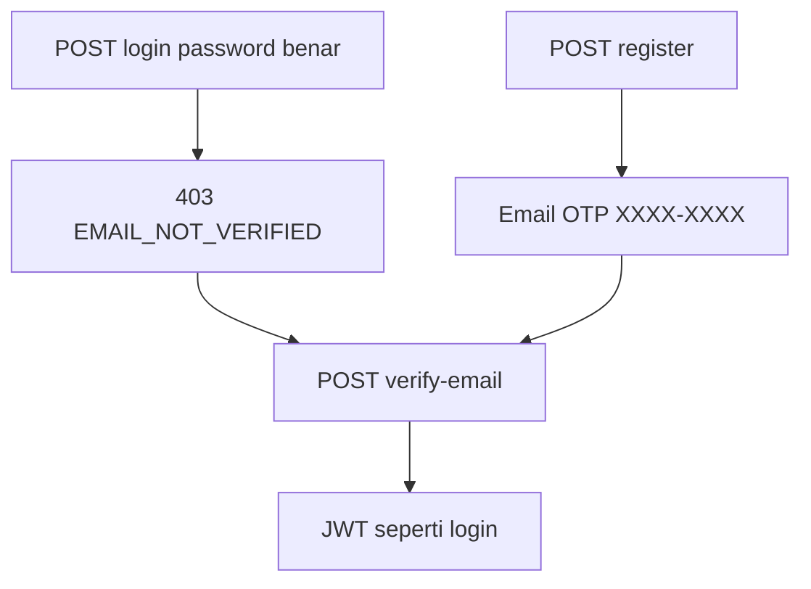

# AUTH_EMAIL_OTP - Verifikasi email sebelum login

Kontrak V1 agar register password tidak langsung aktif. Sumber
kebenaran produk + teknis. Prompt copy-paste:
[`../api/00-api-auth.md`](../api/00-api-auth.md) (backend, bagian OTP),
[`../mobile/14-mobile-auth-email-otp.md`](../mobile/14-mobile-auth-email-otp.md)
(Flutter). Google Sign-In **bukan** PR ini; lihat
[`AUTH_GOOGLE.md`](AUTH_GOOGLE.md) (user Google skip OTP).

V1: **API + mobile**. Admin memakai endpoint yang sama. User lama
di-backfill `email_verified=true`.

Ditetapkan 2026-09-21.

---

## Situasi sekarang

Register `is_active=true` tanpa OTP, lalu mobile auto-login. Kualitas
akun lemah (email fiktif). MailerPort + Resend **sudah ada** (lupa
password). Kolom `users.email_verified` belum ada.

---

## Alur V1



1. Register password: user `email_verified=false`, OTP 8 karakter 0-9A-Z dikirim
   email. Response 201 tanpa JWT. `verification_required: true`.
2. Email menampilkan kode `XXXX-XXXX` (contoh `A4K9-M2XP`).
3. Login password benar tapi belum verifikasi: 403 `EMAIL_NOT_VERIFIED`,
   tanpa token. Client sheet lalu halaman verifikasi.
4. `POST /verify-email` sukses: `email_verified=true`, JWT seperti login.
5. Google (nanti): user baru `email_verified=true`, skip OTP.

---

## Keputusan V1

- Email lewat **MailerPort**. Default Resend (`RESEND_API_KEY`).
  `MAIL_PROVIDER=resend|smtp`. Vendor baru = impl baru, use case tetap.
- OTP 8 karakter 0-9A-Z, hash SHA-256 (`user_id` + kode), TTL 10 menit, max 5
  percobaan. Jangan kirim kode di JSON.
- Satu OTP aktif per user. Resend mengganti kode lama.
- `POST /resend-otp` selalu 200 (anti-enumeration).
- Password salah tetap `INVALID_CREDENTIALS` (anti-enumeration).
  403 hanya jika password **benar** dan belum verifikasi.
- User existing: migration set `email_verified=true`.
- Kunci Resend hanya di API, bukan APK.

---

## Kontrak API

`POST /api/v1/auth/register` 201:

```json
{
  "success": true,
  "data": {
    "user_id": "01...",
    "username": "...",
    "email": "...",
    "phone": null,
    "verification_required": true
  }
}
```

`POST /api/v1/auth/verify-email`

```json
{ "email": "budi@example.com", "code": "A4K9M2XP", "client_type": "mobile" }
```

`code` juga boleh `A4K9-M2XP`. Response 200 = envelope login.

`POST /api/v1/auth/resend-otp` `{ "email": "..." }` 200 jika email tak
dikenal (anti-enumeration). 429 `RATE_LIMITED` jika OTP terakhir < 2
menit (per email) atau 1 kali / 2 menit per IP.

`POST /api/v1/auth/login` jika belum verifikasi: 403

```json
{
  "success": false,
  "error_code": "EMAIL_NOT_VERIFIED",
  "message": "Email belum diverifikasi. Cek kotak masuk untuk kode OTP.",
  "details": [{ "field": "email", "message": "budi@example.com" }]
}
```

Error: `EMAIL_NOT_VERIFIED` 403, `INVALID_OTP` 401, `OTP_EXPIRED` 401.

Rate limit: verify-email 5/15 menit per IP; resend-otp 1/2 menit per IP
dan cooldown 2 menit per email.

---

## Kontrak mobile

Register sukses: jangan auto-login. Buka `/verify-email?email=`.
Login 403: bottom sheet, CTA ke halaman yang sama.
Halaman: input 8 karakter 0-9A-Z (tampilan `XXXX-XXXX`), kirim ulang, sukses
`saveTokens` + `markLoggedIn`.

---

## Out of scope V1

- Google Sign-In (PR terpisah; set `email_verified=true`)
- OTP SMS
- Ubah email setelah daftar
