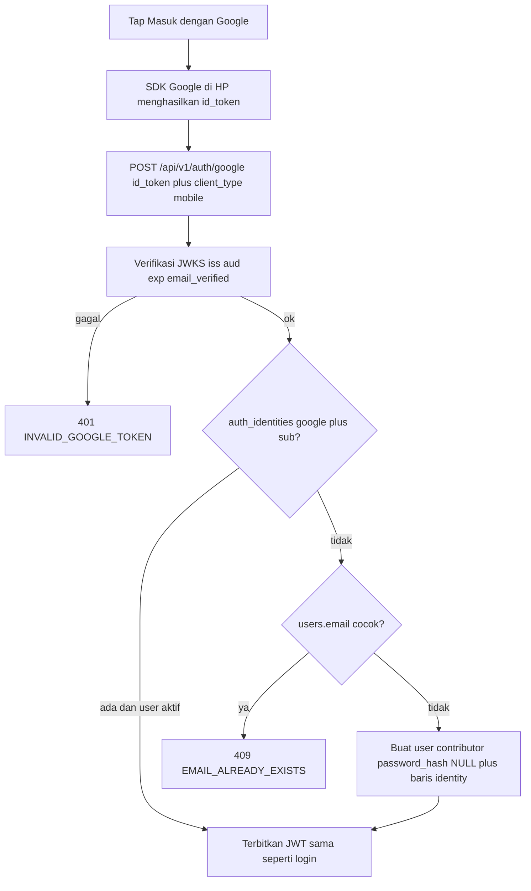

# AUTH_GOOGLE - Masuk dengan Google

Status **V1 implemented** (2026-09-21). Keputusan produk yang tidak
dinegosiasi ulang. Kontrak hidup:
[`../api/24-api-auth-google.md`](../api/24-api-auth-google.md) (backend),
[`../mobile/13-mobile-auth-google.md`](../mobile/13-mobile-auth-google.md)
(Flutter).

V1: **API + mobile**. Admin tetap email/password.

---

## Situasi sekarang

Login email/password sudah lengkap (JWT RS256, refresh web cookie /
mobile body). Register password wajib OTP email
([`AUTH_EMAIL_OTP.md`](AUTH_EMAIL_OTP.md)). Ubah password sudah
menolak akun OAuth-only (`OAUTH_NO_PASSWORD`).

Fondasi Google yang **sudah ada** (jangan diduplikasi):

- Migration `0008_auth-identities-oauth.sql`: tabel `auth_identities`,
  `users.password_hash` nullable
- Schema
  [`auth-identities.schema.ts`](../../api/src/shared/database/drizzle/schema/auth-identities.schema.ts)
- Login password menolak hash NULL
  ([`login-user.use-case.ts`](../../api/src/modules/auth/application/use-cases/login-user.use-case.ts))
- Sketsa lama di `api-base-stack.md` Section 23 (aturan auto-link di
  sana **dibatalkan**; lihat keputusan di bawah)

Yang **sudah di kode V1**: verifier Google, `POST /api/v1/auth/google`,
env `GOOGLE_CLIENT_ID`, Bruno, sample JSON, tombol **Masuk dengan
Google** di login dan **Daftar dengan Google** di register. Di luar V1:
Apple/GitHub, taut/lepas akun, foto Google, banyak `aud`, tombol
Google admin.

---

## Alur V1



1. User tap **Masuk dengan Google** di login atau register.
2. SDK Google di perangkat menghasilkan ID token.
3. App `POST /api/v1/auth/google` dengan `id_token` + `client_type: mobile`.
4. Backend verifikasi token, cocokkan `sub` / tolak email yang sudah
   terdaftar / buat user baru.
5. Response sama persis dengan login biasa. Client menyimpan token
   lewat jalur yang sudah ada.

Backend **bukan** target redirect OAuth. Client yang menjalankan SDK;
API hanya menerima ID token.

---

## Keputusan V1

- **Tidak auto-link.** Password register wajib OTP, tetapi menempelkan
  identitas Google ke baris `users` hanya karena email cocok tetap
  dilarang di V1 (penyerang bisa daftar dulu). Email Google yang sudah
  ada di `users` → `409 EMAIL_ALREADY_EXISTS`.
  Pesan: "Email sudah terdaftar. Masuk dengan password atau gunakan
  lupa password." User Google murni (email belum ada) tetap dibuat
  dengan `email_verified=true` (skip OTP).
- Taut/lepas Google saat sudah login **bukan V1**.
- Satu client ID per env API (`GOOGLE_CLIENT_ID` staging ≠ production
  boleh). Flutter memakai nilai matching sebagai `serverClientId`
  supaya klaim `aud` di ID token cocok.
  Client OAuth Android/iOS tetap dibuat di Google Cloud Console untuk
  SDK native, tetapi backend **hanya** memverifikasi Web client ID.
- Env opsional. Kosong → `503 GOOGLE_AUTH_UNAVAILABLE`. API tidak crash
  (pola ImageKit / Unsplash).
- Role tidak pernah dari Google. User baru = `contributor`. Admin yang
  ingin Google menyusul lewat taut eksplisit, bukan V1.
- Identitas stabil = Google `sub`, bukan email.
- `client_type` wajib di body endpoint (default `web`) supaya kanal
  refresh sama dengan login: cookie vs body.
- Audit hanya saat **user baru** (`action: 'create'`, `via: 'google'`).
  Login ulang tidak diaudit (preseden password login).
- Unique `(provider, provider_user_id)` sudah ada. V1 tidak unlink.
  Lookup identity **termasuk** baris soft-deleted: kalau `deleted_at`
  terisi, gagal tertutup (`INVALID_GOOGLE_TOKEN`), jangan insert ulang
  (unique masih memblokir).

---

## Kontrak API

`POST /api/v1/auth/google` (publik). Rate limit 5/15 menit per IP,
setara `/login`.

Body:

```json
{
  "id_token": "eyJhbGciOiJSUzI1NiIs...",
  "client_type": "mobile"
}
```

`client_type`: `'web'` (default) | `'mobile'`.

Response 200: envelope login standar. `refresh_token` hanya jika
`client_type` = `mobile`. Web: Set-Cookie httpOnly, path `/api/v1/auth`.

Verifier: `GoogleTokenVerifierPort` + `jose` (`createRemoteJWKSet` +
`jwtVerify`, Web Crypto). Cek:

- `iss` ∈ `https://accounts.google.com` | `accounts.google.com`
- `aud` === `GOOGLE_CLIENT_ID`
- `exp` (lewat `jwtVerify`)
- `email_verified === true`
- `sub` dan `email` ada

Identitas rusak / email Google belum verified / `iss`/`aud` salah /
user identity ada tapi `is_active=false` atau `deleted_at` terisi →
satu kode: `401 INVALID_GOOGLE_TOKEN`, pesan generik "Tidak bisa masuk
dengan Google." (anti-enumeration).

User baru:

- `email` lewat `Email.create` (trim + lowercase)
- `password_hash` NULL, `phone` NULL, `role` `contributor`, `is_active`
  true
- Username: `name` Google (trim); kosong → local-part email; masih
  kosong → `user`. Potong 80 karakter. Bentrok `findByUsername` →
  sufiks `2`..`99`, lalu 4 digit acak.
- Satu transaksi: insert `users` + `auth_identities`. Race unique
  identity → lookup ulang lalu login (dua tap bersamaan).

Error:

| HTTP | error_code | Kapan |
| ---- | ---------- | ----- |
| 400 | `VALIDATION_ERROR` | `id_token` kosong |
| 401 | `INVALID_GOOGLE_TOKEN` | token / iss / aud / exp / email_verified / akun nonaktif / identity terhapus |
| 409 | `EMAIL_ALREADY_EXISTS` | email Google sudah ada di `users`, belum ada baris identity Google |
| 429 | `RATE_LIMITED` | 5/15 menit per IP |
| 503 | `GOOGLE_AUTH_UNAVAILABLE` | `GOOGLE_CLIENT_ID` kosong |

`EMAIL_ALREADY_EXISTS` sudah di katalog (register). Dua kode baru
didaftarkan di `ERROR_CODES.md` pada PR implementasi, bukan PR kontrak
ini.

Lupa password tetap jalan untuk akun Google: `reset-password` mengisi
`password_hash`. Setelah itu user bisa login password **atau** Google
(`sub` sudah tertaut). Ubah password sebelum reset tetap
`OAUTH_NO_PASSWORD`.

---

## Kontrak mobile

Tombol di **login dan register** (satu use case, endpoint sama).
Paket `google_sign_in`. `serverClientId` = client ID envied per flavor
(`GOOGLE_WEB_CLIENT_ID_STAGING` / `_PRODUCTION`, opsional). Kosong →
tombol tidak dirender.

Setelah SDK sukses: `POST /auth/google` + `client_type: mobile`, lalu
reuse `AuthTokenStorage.saveTokens` + `AuthStatusNotifier.markLoggedIn`
(pola login password). Jangan invalidate auth status.

Mapping UI:

- 409: tampilkan `message` backend (bukan "email atau password salah")
- 401 `INVALID_GOOGLE_TOKEN`: pesan generik backend
- 503: sembunyikan/disable tombol
- 429: toast coba lagi + `Retry-After`
- User batal di sheet Google: diam, bukan error

Prasyarat konsol Google (kerja implementasi, bukan PR docs ini):
OAuth client Web + Android (SHA-1) + iOS (URL scheme / `GIDClientID`).

---

## Out of scope V1

- Tombol Google di admin (GIS)
- Apple / GitHub
- Taut atau lepas akun saat sudah login
- Simpan foto Google
- Redirect OAuth di backend
- Banyak `GOOGLE_CLIENT_ID` (Android/iOS sebagai `aud` terpisah)
- Endpoint `GET /auth/providers`

---

## Checklist implementasi

- [x] `GoogleTokenVerifierPort` + impl `jose` + env `GOOGLE_CLIENT_ID`
      opsional
- [x] `AuthIdentityRepository` + `LoginWithGoogleUseCase` (3 cabang:
      identity ada, email bentrok 409, user baru)
- [x] `POST /api/v1/auth/google` + `client_type` + rate limit
- [x] Error code `INVALID_GOOGLE_TOKEN`, `GOOGLE_AUTH_UNAVAILABLE`
- [x] Unit + e2e (mock port) + Bruno `http/auth/login-google.bru` +
      sample `docs/json/auth/`
- [x] Mobile: `google_sign_in`, tombol login + register, envied
      `GOOGLE_WEB_CLIENT_ID_STAGING` / `_PRODUCTION`
- [x] Widget test: tombol tersembunyi jika client ID kosong; 409 tampil
      pesan email sudah terdaftar

---

## Referensi

- Kontrak API: [`../api/24-api-auth-google.md`](../api/24-api-auth-google.md)
- Kontrak mobile:
  [`../mobile/13-mobile-auth-google.md`](../mobile/13-mobile-auth-google.md)
- Ringkasan stack: [`../api/api-base-stack.md`](../api/api-base-stack.md)
  Section 23
- Login/register: [`../api/00-api-auth.md`](../api/00-api-auth.md)
- OAuth-only password: [`../api/10-api-ubah-password.md`](../api/10-api-ubah-password.md)
- Peta jalan: [`NEXT.md`](NEXT.md)
