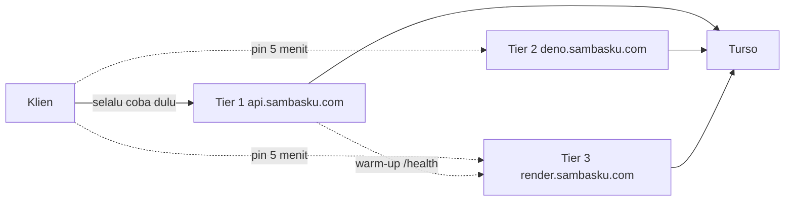

# Circuit breaker tiga tier API

Cadangan `api.sambasku.com` bukan Worker kedua. Kuota request harian dan
batas subrequest Workers dihitung per akun Cloudflare: script lain di
akun yang sama menghabiskan ember yang sama. Router di depan yang juga
Worker sama buruknya - dia sendiri yang kena limit.

Tiga host, satu database Turso, satu pasangan kunci JWT:

| Tier | Host | Runtime | Jaringan |
|---|---|---|---|
| 1 | `https://api.sambasku.com` | Cloudflare Worker | anycast akun ini |
| 2 | `https://deno.sambasku.com` | Deno Deploy (`runtime: node`) | orange-cloud ke anycast yang sama |
| 3 | `https://render.sambasku.com` | Render free (`runtime: node`) | CNAME ke `sambasku-api.onrender.com`, DNS-only |

`APP_URL` di setiap tier tetap `https://api.sambasku.com` (host API
kanonis). Link email / Universal Links memakai `WEB_APP_URL`
(`https://sambasku.com`) supaya tidak menunjuk host cadangan API dan
tetap bisa membuka app.



## Kenapa tiga, dan urutannya

Tier 2 menyelesaikan batas subrequest: record proxied yang tidak terikat
route Worker tidak menghitung kuota compute. Tier 2 **bukan** independen
dari edge Cloudflare - `deno.sambasku.com` resolve ke IP anycast yang
sama dengan tier 1. Insiden edge membawa keduanya.

Tier 3 independen secara topologi (akun Cloudflare Render, bukan akun
ini) dan paling cepat saat hangat, tetapi paket gratis tidur setelah
~15 menit dan bangun sampai ~60 detik. Cold-start itu alasan ia
diletakkan terakhir, bukan dijadikan primer.

## Trip table

Memindahkan tier:

- Timeout koneksi, atau koneksi putus tanpa respons
- HTTP 502, 503, 504
- HTTP 503 `error_code: UPSTREAM_CAPACITY` (batas subrequest / CPU Worker)
- Body non-JSON pada respons gagal (halaman HTML Cloudflare 1015/1027/1101/1102)

Tidak memindahkan:

- 401 - urusan interceptor auth
- 429 `RATE_LIMITED` - pindah host justru menembus limit
- 400 / 403 / 404 / 409 / JSON `500 INTERNAL_ERROR`

`UPSTREAM_CAPACITY` khas Workers. Tier 2 dan 3 adalah proses Node tanpa
batas subrequest, jadi mereka tidak pernah mengirim kode itu. Itulah
gunanya: sinyal itu menandai kegagalan yang hanya terjadi di primer.

Ulang otomatis hanya GET dan HEAD. POST / PATCH / PUT / DELETE tetap
memajukan pin, tetapi error naik ke UI supaya percobaan ulang pengguna
sendiri yang mendarat di tier baru. Timeout terima pada mutasi tidak
diulang: server mungkin sudah menyimpan.

Aturan cascade:

1. Naik satu tier per kegagalan. Gagal di 1 → pin 2; gagal di 2 → pin 3.
2. Tier 3 terminal. Tidak ada host keempat.
3. Tiap pin 5 menit. Habis masa, request berikutnya mencoba **tier 1
   lagi**, bukan tier di tengah, supaya primer yang sudah pulih langsung
   dipakai.

Pin hidup di memori proses klien. Oracle / Cloudflare / Deno / Render
tidak memegang pin. Pin mobile hilang saat aplikasi dibunuh.

## Warm-up, bukan cron

Cron 24/7 untuk menjaga Render melek akan memakan ~730 dari 750 jam
gratis per bulan - kuota justru habis saat cadangan diperlukan. Saat
breaker pin ke tier 2, klien menembak satu `GET /health` ke tier 3
(sekali per jendela pin, fire-and-forget). Render mulai boot di
belakang layar. Hari biasa, tier 3 tetap tidur dan tidak memakan jam.

Timeout per tier: 15 detik di 1 dan 2; 75 detik di 3 (mobile + console).
Web SSR membatasi tier 3 ~20 detik lalu memakai degradasi anggun yang
sudah ada (search / words mengembalikan hasil kosong).

## Sesi

Mobile menyimpan refresh token di penyimpanan aman dan mengirimkannya
di body `POST /api/v1/auth/refresh`. JWT tetap sah di semua tier karena
kunci sama.

Console memakai cookie `refresh_token` dengan
`Domain=.sambasku.com` (`REFRESH_COOKIE_DOMAIN` di Worker, Deno, dan
Render - wajib identik). Tanpa itu browser tidak mengirim cookie ke
host cadangan dan admin terlempar ke login. `deleteCookie` memakai
atribut domain yang sama, atau logout gagal membersihkan cookie.

Rate limit adalah `RateLimiterMemory` per proses. Tiga host = tiga
ember. Diterima untuk cadangan yang jarang kepakai.

## Di mana kodenya

| Klien | Titik masuk |
|---|---|
| API | `api/src/shared/errors/infra-failure.ts` → 503 `UPSTREAM_CAPACITY` |
| Mobile | `mobile/lib/core/network/failover/` + DevTool `ApiHostInspector` |
| Web | `web/app/infrastructure/api/failover.ts` + `api-client.ts` |
| Console | `console/src/shared/api/failover.ts` + banner di `console-layout` |
| Bruno | environment lokal `production` / `production-deno` / `production-render` |

Flavor staging tidak punya cadangan. Interceptor diam.

## CI

Job Worker di `api/.github/workflows/deploy-production.yml` tetap
primer. File itu tidak diubah di PR ini (hook editor memblokir
suntingan workflow). Tambahkan sibling
`api/.github/workflows/verify-failover-tiers.yml` secara manual:

```yaml
name: Verify failover tiers
on:
  workflow_run:
    workflows: ["Deploy Production (Cloudflare Workers)"]
    types: [completed]
  workflow_dispatch:
permissions:
  contents: read
jobs:
  deploy-hooks:
    if: ${{ github.event_name == 'workflow_dispatch' || github.event.workflow_run.conclusion == 'success' }}
    runs-on: ubuntu-latest
    steps:
      - env:
          HOOK: ${{ secrets.DENO_DEPLOY_HOOK_URL }}
        run: |
          if [ -z "$HOOK" ]; then echo "DENO_DEPLOY_HOOK_URL kosong"; exit 0; fi
          curl -fsS -X POST --max-time 30 "$HOOK"
      - env:
          HOOK: ${{ secrets.RENDER_DEPLOY_HOOK_URL }}
        run: |
          if [ -z "$HOOK" ]; then echo "RENDER_DEPLOY_HOOK_URL kosong"; exit 0; fi
          curl -fsS -X POST --max-time 30 "$HOOK"
  verify-tiers:
    needs: deploy-hooks
    if: ${{ github.event_name == 'workflow_dispatch' || github.event.workflow_run.conclusion == 'success' }}
    runs-on: ubuntu-latest
    steps:
      - run: sleep 20
      - env:
          TIER1: https://api.sambasku.com
          TIER2: https://deno.sambasku.com
          TIER3: https://render.sambasku.com
        run: |
          set -eu
          fail=0
          check() {
            url="$1"; expect="$2"
            body="$(curl -fsS --max-time 90 "$url/api/v1/ping")" || { echo "::error::$url down"; fail=1; return 0; }
            case "$body" in *"\"host\":\"$expect\""*) ;; *) echo "::error::$url host mismatch"; fail=1 ;; esac
          }
          check "$TIER1" "api.sambasku.com"
          check "$TIER2" "deno.sambasku.com"
          check "$TIER3" "render.sambasku.com"
          exit "$fail"
```

Secret opsional di repo `api`:

- `DENO_DEPLOY_HOOK_URL` - POST untuk memicu deploy Deno
- `RENDER_DEPLOY_HOOK_URL` - POST untuk memicu deploy Render

Kalau secret kosong, hook dilewati. Job verify tetap menembak ping ke
ketiga host: workflow merah kalau cadangan mati, Worker yang sudah
terpasang tidak dibatalkan.

APK lama yang belum memuat interceptor ini tetap hanya mengenal
`api.sambasku.com` sampai pengguna memperbarui aplikasi.
