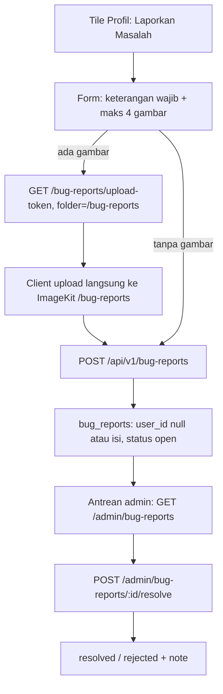

# REPORT_BUG - Laporan masalah user, anonim boleh, lampiran gambar opsional

Catatan kontrak (2026-09-21), **sebelum** ditulis ke `docs/api/`,
`docs/mobile/`, dan `docs/admin/`. Menutup tile Profil "Laporkan
Masalah" yang sudah tampil sebagai toast "segera hadir" (lihat
[NEXT.md](NEXT.md), Prioritas 1).

Estimasi implementasi setelah kontrak disalin: **2-3 hari** (API 1,
mobile 1, antrean admin 0.5).

> Prompt implementasi nanti: tulis `docs/api/26-api-bug-reports.md`,
> `docs/mobile/15-mobile-report-bug.md`,
> `docs/admin/15-admin-bug-reports.md`. File ini sumber kebenaran
> sampai langkah itu.

---

## Intent

User (guest maupun yang login) menemukan masalah di aplikasi, buka
form **Laporkan Masalah** dari Profil, menulis keterangan, boleh
melampirkan sampai **4 screenshot**, lalu kirim. Keterangan wajib,
gambar nullable. Laporan masuk antrean admin; admin membaca, lalu
menandai selesai / ditolak.

Anonim adalah keputusan produk sadar: bug paling sering ditemukan
saat user sedang browsing tanpa login, dan friction "login dulu untuk
lapor" mematikan niat melapor.

---

## Situasi sekarang

- Tile "Laporkan Masalah" di Profil sudah tampil, masih toast.
- Infrastruktur yang bisa direuse:
  - **Direct-upload ImageKit**: `GET /api/v1/admin/images/upload-token`
    (auth + role) → client upload sendiri ke CDN → kirim
    `{url, provider_file_id}` di body. Mobile sudah punya pola lengkap
    (`WordImageUploadService` + `ImageKitUploader`).
  - **Rate limit anonim dual bucket** per `X-Device-Id` + per IP
    (`06-api-x-device-id.md`, dipakai kontribusi kata anonim). Mobile
    sudah mengirim header ini via interceptor.
  - **Antrean + role admin**: pola modul contribution/audit; notifikasi
    inbox (doc 23) ada kalau nanti mau konfirmasi.
- Batasan yang memaksa keputusan: endpoint token upload yang ada
  **wajib login** (`authorizeRole` contributor ke atas). Tamu tidak
  bisa minta token → butuh jalur token publik khusus laporan.

---

## Keputusan (tetap sampai diganti di file ini)

1. **Satu form untuk tamu dan user login.** Tidak ada field wajib
   berbeda. `user_id` nullable: null = anonim.
2. **Keterangan wajib** (10-2000 karakter). **Gambar nullable**,
   maksimal **4** file, JPEG/PNG hasil kompresi client (pola
   kontribusi kata).
3. **Metadata diambil otomatis, bukan diisi user**: `app_version`
   (package_info_plus) dan `platform` (`android`/`ios`). Dua data
   yang selalu ditanya saat reproduksi; gratis dari device.
4. **Token upload publik, terkunci folder.** Endpoint baru
   `GET /api/v1/bug-reports/upload-token` tanpa auth, `folder`
   **hanya boleh `/bug-reports`** (tolak lainnya), dual bucket rate
   limit. Jalur `/admin/images/upload-token` yang lama tidak diubah.
   Gambar laporan terisolasi di folder CDN sendiri - gampang di-purge
   massal kalau disalahgunakan.
5. **Gambar disimpan sebagai kolom JSONB** `images` di tabel
   `bug_reports` (`[{url, provider_file_id}]`), bukan tabel anak.
   Berbeda dari `word_images` karena lampiran laporan bukan konten
   domain: tidak divote, tidak dimoderasi per item, tidak pernah
   tampil publik. Tanpa join.
6. **Status**: `open` → `resolved` | `rejected`, set oleh admin.
   Terminal; laporan baru dibuat baru. Tanpa assign/label/priority.
7. **Antrean admin baca-satu-arah**: `GET /admin/bug-reports` (filter
   status, cursor) + `POST /admin/bug-reports/:id/resolve`
   `{status, note?}`. Role admin + root. Komentar/note opsional.
8. **Rate limit**: submit anonim 5/jam per device + 20/jam per IP
   (angka rumah doc 06); submit login 5/jam per user_id; token
   publik 20/jam per device + 40/jam per IP (satu laporan 4 gambar =
   4 token, sisakan ruang retry).
9. **Tidak ada notifikasi resolve di V1.** Tamu memang tidak bisa
   dinotifikasi; user login menyusul sebagai delta modul notification
   kalau antrean benar-benar dipakai.
10. **Laporan tidak tampil di Usulanku.** Beda siklus hidup dengan
    kontribusi kata (tidak ada approval gate konten); mencampurnya
    akan mengubah kontrak Usulanku.

Ditolak untuk V1:

| Opsi | Alasan |
| ---- | ------ |
| Reuse `/admin/images/upload-token` untuk semua | 403 untuk tamu; melonggarkan role di endpoint lama memperluas permukaan token upload yang ada untuk konten kata |
| Upload gambar lewat backend (multipart) | Melanggar pola rumah: backend tidak pernah melewati byte gambar; memory/bandwidth Workers |
| Tabel anak `bug_report_images` | Tidak ada siklus hidup per gambar; JSONB lebih pendek ditulis dan dibaca |
| Form kategori (bug/ide/konten) + konteks `word_id` | NEXT.md membayangkan itu untuk laporan terikat konten; requirement ini laporan bebas. Delta menyusul, struktur tidak menghalangi |
| Email konfirmasi ke pelapor | Anonim tidak punya email; user login pakai inbox notifikasi (delta berikutnya) |
| Status `in_progress` + assignee | Skala sekarang: satu tim kecil, dua status akhir cukup |

---

## Alur



---

## Kontrak API

Mengikuti `api-base-stack.md`: envelope Section 13, ULID Section 19,
cursor pagination Section 13, rate limit Section 15, audit Section 21.
**Env baru: tidak ada** (pakai `IMAGEKIT_*` yang sudah ada).

### 1. Tabel `bug_reports` (+ `docs/dbdiagram.dbml`)

| Kolom | Tipe | Catatan |
| ----- | ---- | ------- |
| `id` | `varchar(26)` PK | ULID |
| `user_id` | `varchar(26)` FK users, **nullable** | null = anonim |
| `device_id` | `varchar(64)` nullable | dari `X-Device-Id`, untuk jejak spam tamu |
| `description` | `text` NOT NULL | 10-2000 karakter |
| `images` | `jsonb` NOT NULL default `'[]'` | maks 4 item `{url, provider_file_id}` |
| `app_version` | `varchar(20)` nullable | otomatis dari client |
| `platform` | `varchar(10)` nullable | `android` / `ios` |
| `status` | `varchar(20)` default `'open'` | `open`, `resolved`, `rejected` |
| `resolution_note` | `text` nullable | diisi admin saat resolve |
| `resolved_by` / `resolved_at` | nullable | FK users / timestamptz |
| `created_by`* / `updated_by` / `deleted_at` / `deleted_by` / `created_at` / `updated_at` | | aturan rumah. *`created_by` = `user_id` saat login, null saat anonim |

Index: `(status, id)` untuk antrean cursor; `user_id`, `device_id`.

### 2. `GET /api/v1/bug-reports/upload-token`

Publik (tanpa auth). Query hanya `folder`; nilai **selain**
`/bug-reports` → 400 `VALIDATION_ERROR` field `folder`
(`Folder upload tidak valid`). ImageKit belum dikonfigurasi → 503
`IMAGE_UPLOAD_UNAVAILABLE` (kode lama, UI sembunyikan bagian gambar).

Response 200 = bentuk kredensial upload yang sama dengan endpoint
admin (token + signature + expire). Rate limit dual bucket
(keputusan 8). Reuse `ImageController.uploadCredentials` /
port yang sama - controller baru hanya membungkus dengan lock folder.

### 3. `POST /api/v1/bug-reports`

Auth **opsional** (token valid → user login; tanpa token → anonim).
Header `X-Device-Id` diharapkan dari mobile (sudah di interceptor).

Body:

```json
{
  "description": "Tombol upvote tidak merespons di halaman detail kata",
  "images": [
    { "url": "https://ik.imagekit.io/.../bug-reports/x.jpg", "provider_file_id": "abc123" }
  ],
  "app_version": "0.1.0",
  "platform": "android"
}
```

Validasi (pesan ala `api-pesan-validasi`, label manusia):

| Field | Aturan | Pesan |
| ----- | ------ | ----- |
| `description` | wajib, trim 10-2000 | `Keterangan wajib diisi minimal 10 karakter` |
| `images` | opsional, array maks 4; tiap item `url` wajib http(s) + `provider_file_id` string | `Lampiran tidak boleh lebih dari 4 gambar` / `Alamat gambar tidak valid` |
| `app_version` | opsional maks 20 | - |
| `platform` | opsional enum `android`, `ios` | `Platform tidak valid` |

Response 200: `data` = `{ "id", "status": "open", "submitted_at",
"is_anonymous": true|false }`. Tidak ada token/identitas lain
dibalas ke tamu.

Rate limit: anonim 5/jam per device + 20/jam per IP; login 5/jam per
user_id → 429 `RATE_LIMITED` + `Retry-After`.

### 4. `GET /api/v1/admin/bug-reports` (admin + root)

Query: `status` (opsional: `open`/`resolved`/`rejected`),
`limit` 1-50 default 20, `cursor` (ULID, urut terbaru dulu - Section
13). Item: semua kolom kecuali soft-delete; `images` apa adanya;
plus `username` pelapor (null untuk anonim) dari join users.

### 5. `POST /api/v1/admin/bug-reports/:id/resolve` (admin + root)

Body `{ "status": "resolved" | "rejected", "note": string opsional }`.
Id tidak ada / sudah resolved / soft-deleted → 404
`BUG_REPORT_NOT_FOUND` (`Laporan tidak ditemukan`). Ubah status + isi
`resolution_note`, `resolved_by`, `resolved_at`. Response 200: data
laporan terbaru.

### 6. Error code baru

| error_code | HTTP | Kapan |
| ---------- | ---- | ----- |
| `BUG_REPORT_NOT_FOUND` | 404 | resolve pada id yang tidak ada |

Reuse: `VALIDATION_ERROR`, `RATE_LIMITED`, `IMAGE_UPLOAD_UNAVAILABLE`,
`UNAUTHORIZED`, `FORBIDDEN`. Tambah ke `ERROR_CODES.md` di PR sama.

### 7. Audit

Submit → `create` `entity_type='bug_report'` (`user_id` null saat
anonim - pola aksi tanpa akun). Resolve → `update`. Old/new data pada
resolve memuat status + note.

### 8. Modul API (delta)

```
api/src/modules/bug-report/
├── domain/entities/bug-report.entity.ts
├── application/use-cases/
│   ├── create-bug-report.use-case.ts
│   ├── list-bug-reports.use-case.ts
│   └── resolve-bug-report.use-case.ts
├── infrastructure/bug-report.repository.impl.ts
└── presentation/v1/
    ├── bug-report.routes.ts        # publik: upload-token + submit
    ├── admin-bug-report.routes.ts  # admin: list + resolve
    └── validators/bug-report.validator.ts
```

Plus: `shared/database/drizzle/schema/bug-reports.schema.ts`,
migration `pnpm drizzle-kit generate --name=create-bug-reports`,
update `docs/dbdiagram.dbml`.

Tes unit: description pendek → 400; images item 5 → 400; anonim
menulis `user_id` null + `device_id` terisi; login → `user_id`
terisi; resolve id hilang → `BUG_REPORT_NOT_FOUND`; resolve dua kali
→ 404; token endpoint folder lain → 400.

Bruno / JSON (saat implementasi):

- `http/bug-report/upload-token.bru`, `submit-anon.bru`,
  `submit-auth.bru`, `admin-list.bru`, `admin-resolve.bru`
- `docs/json/bug-report/submit.200.json`,
  `submit.validation.400.json`, `admin-list.200.json`,
  `resolve.404.json`

---

## Kontrak mobile

### Form

- Entry V1: **satu** - tile Profil "Laporkan Masalah" (ganti toast).
- `ReportBugPage`:
  - `description`: multiline text field, wajib, counter karakter
    10-2000. Tombol Kirim disabled saat kosong (< 10) atau sedang
    kirim (anti double-submit, standar rumah).
  - Lampiran: grid maks **4** slot; `image_picker.pickMultiImage`,
    kompresi seperti alur kontribusi kata; bisa hapus per item
    sebelum kirim.
  - Tanpa field versi/platform di UI - dikirim otomatis
    (`package_info_plus`, `Platform.is`).
- Tamu dan login melihat form identik. Banner kecil saat tamu:
  "Laporan kamu dikirim sebagai Anonim" (tanpa CTA login - laporan tidak
    boleh terhalang login).

### Upload & submit

1. Per gambar: `GET /bug-reports/upload-token?folder=/bug-reports`
   (token sekali pakai - pola `WordImageUploadService`) → upload
   langsung ke ImageKit → kumpulkan `{url, providerFileId}`.
2. `POST /api/v1/bug-reports` dengan description + hasil upload +
   `app_version` + `platform`.
3. Soft-fail (wajib, pola kontribusi):
   - Token 503 `IMAGE_UPLOAD_UNAVAILABLE` → bagian lampiran
     disembunyikan, kirim teks tetap bisa.
   - Sebagian gambar gagal upload → toast per gagal, kirim lanjut
     dengan yang sukses (keterangan tetap sampai - lebih penting
     dari screenshot).
   - Semua gagal + teks ada → tawarkan kirim tanpa gambar.
   - Offline → tahan di form, jangan hapus isian (standar rumah).
4. Sukses → snackbar terima kasih + kembali ke Profil. Tidak ada
   halaman riwayat laporan (anonim tidak punya; login menyusul
   kalau diminta).

### Dependensi baru

Tidak ada. `image_picker`, `package_info_plus`, `dio` sudah ada;
uploader di-refactor jadi shared atau di-reuse lewat folder param.

### Modul (delta)

```
mobile/lib/features/report_bug/
├── domain/bug_report_models.dart
├── data/
│   ├── bug_report_repository.dart
│   └── report_image_upload_service.dart   # turunan pola WordImageUploadService
└── presentation/report_bug_page.dart
```

Plus: route `/report-bug`, ganti toast tile Profil jadi navigasi.

---

## Kontrak admin (delta web)

- Menu baru **Laporan Masalah**: list cursor (infinite scroll, pola
  antrean kontribusi), filter chip status open/resolved/rejected.
- Baris: keterangan (render **plain text**, bukan HTML), chip status,
  platform + versi, waktu, pelapor (username atau "Anonim"), thumbnail
  lampiran (klik → buka URL penuh di tab baru).
- Aksi: Selesaikan / Tolak + dialog note opsional →
  `POST /admin/bug-reports/:id/resolve`.
- Kolom kosong bukan error: banyak laporan tanpa gambar/versi.

---

## Kompatibilitas

- Endpoint dan tabel baru total; tidak ada client lama yang pecah.
- `/admin/images/upload-token` lama tidak disentuh (masih auth +
  role) - jalur token publik baru terpisah dan terkunci folder.
- `X-Device-Id` header sudah dikirim interceptor mobile; request
  tanpa header tetap diproses dengan bucket IP saja (fallback 06).

---

## Yang sengaja tidak masuk

- Notifikasi inbox saat laporan selesai (delta modul notification)
- Riwayat "Laporan saya" untuk user login / tampil di Usulanku
- Kategori laporan + konteks `word_id`/`comment_id` (laporan dari
  detail kata/komentar, versi NEXT.md - struktur sekarang tidak
  menghalangi)
- Assignee, priority, threading balasan admin ↔ pelapor
- Purge otomatis folder CDN `/bug-reports` (manual dulu via konsol
  ImageKit; otomatis kalau volumenya nyata)
- Captcha / verifikasi lain untuk anonim (rate limit dual bucket
  dulu, upgrade kalau spam nyata)

---

## Urutan kerja setelah file ini disetujui

1. Tulis `docs/api/26-api-bug-reports.md` + update `dbdiagram.dbml` +
   `ERROR_CODES.md`.
2. Tulis `docs/mobile/15-mobile-report-bug.md` dan
   `docs/admin/15-admin-bug-reports.md`.
3. Kode API: schema + migration + modul bug-report + tes unit.
4. Mobile: form + upload service + wiring tile Profil.
5. Admin: list + resolve.
6. Bruno `http/bug-report/` + `docs/json/bug-report/`.

Jangan mulai kode sebelum langkah 1-2.

---

## Checklist kontrak (centang saat disalin ke docs/api + docs/mobile + docs/admin)

- [x] Tabel `bug_reports` + dbml + partial `images` JSONB maks 4
- [x] Token upload publik terkunci folder `/bug-reports` + dual bucket
- [x] Submit: `description` wajib 10-2000, `images` nullable, auth opsional
- [x] `app_version` + `platform` otomatis dari client
- [x] `BUG_REPORT_NOT_FOUND` masuk `ERROR_CODES.md`
- [x] Rate limit 5/jam device + 20/jam IP (anonim), 5/jam user (login)
- [x] Audit create/update `entity_type='bug_report'`
- [x] Admin list cursor + resolve + note; role admin+root
- [x] Mobile: form anti double-submit, soft-fail upload, tamu = login
- [x] Bruno + `docs/json/bug-report/`
- [ ] Setelah ship: pindah file ini ke `docs/backlogs/done/`
