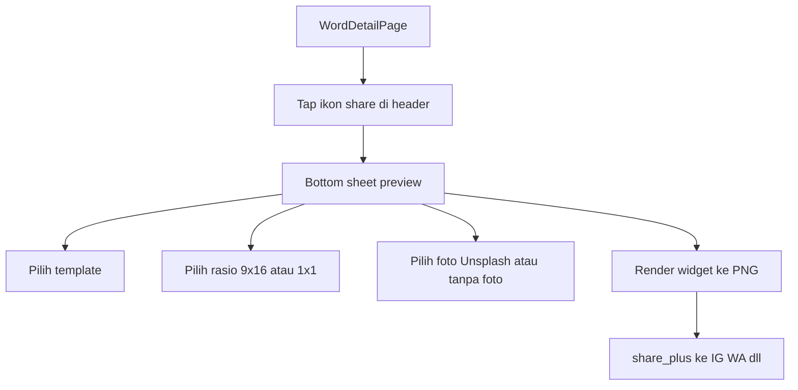

# SHARE - Kartu share kosakata

Backlog kartu gambar untuk dibagikan ke cerita IG, feed, WhatsApp, dan
sejenisnya. V1 **mobile saja**: generate PNG di app, lalu native share
sheet. Melengkapi item “Word of the Day + share card” di
[`../NEXT.md`](../NEXT.md).

Estimasi implementasi V1: **2-3 hari**.

---

## Situasi sekarang

Loop baca kata sudah ada: pencarian →
[`word_detail_page.dart`](../../mobile/lib/features/dictionary/presentation/pages/word_detail_page.dart)
(`GET /api/v1/words/:id`). Header detail hanya punya back, riwayat, dan
bookmark. Tidak ada tombol share, `share_plus`, atau generate kartu.

Data yang sudah cukup untuk kartu:

- Lemma - `detail.lemma`
- Kelas kata - `meaning.wordClassName` (bukan `wordType`)
- Definisi - `meaning.definition`
- Padanan Indonesia - `meaning.translations[].text` (utamakan tipe `direct`)
- Contoh - `meaning.examples[].sourceSentence` (opsional di kartu)
- Kategori - `detail.categories[].name` (untuk query foto, bukan teks kartu)

Yang **belum**: Unsplash, endpoint latar, generate PNG, App Links, halaman
web publik, Word of the Day.

---

## Alur V1

1. User buka detail kata.
2. Tap ikon share di suffix header (sebelah bookmark).
3. Bottom sheet menampilkan preview kartu hidup.
4. User memilih template, rasio, dan latar.
5. App merender widget ke PNG, lalu membuka share sheet native beserta
   caption teks.

Kata di detail publik sudah `published`. Tidak perlu gerbang status
tambahan di V1.

---

## Keputusan V1

- Generate kartu di Flutter (`RepaintBoundary` → `toImage` → file temp).
  Bukan PNG di API, bukan overlay ImageKit.
- Latar: **Unsplash** (3 kandidat) + chip **Tanpa foto** (gradien / kertas).
  Foto kata ImageKit tidak dipakai di V1.
- Kunci Unsplash **tidak** masuk APK. Proxy tipis
  `GET /api/v1/share/backgrounds?q=` + cache 24 jam.
- Query foto = **padanan + nama kategori**, bukan lemma Sambas.
  Contoh: lemma `makatn` → query `makan makanan`. Lemma daerah tidak
  ada di indeks Unsplash.
- Gagal jaringan / kuota Unsplash → otomatis mode tanpa foto. Share
  tidak boleh rusak.
- Caption ikut terkirim:
  `"makatn" - makan · kamus bahasa Sambas #SambasKu`

---

## Isi kartu (wajib)

| Elemen        | Sumber                         | Aturan                                      |
| ------------- | ------------------------------ | ------------------------------------------- |
| Lemma         | `detail.lemma`                 | Dominan secara tipografi                    |
| Kelas kata    | `meaning.wordClassName`        | Pill atau label kecil                       |
| Definisi      | `meaning.definition`           | Maks 2 baris, ellipsis                      |
| Padanan ID    | terjemahan `direct` pertama    | Fallback: terjemahan pertama apa adanya     |
| Watermark     | tetap                          | `SambasKu` + fotografer Unsplash bila ada   |

Kalau makna lebih dari satu: pemilih makna di sheet. Default = makna
dengan `orderIndex` terkecil.

Safe zone: teks penting di tengah ~70% tinggi kanvas. Chrome IG Stories
memotong atas dan bawah.

Font (via `google_fonts`): lemma **Fraunces** atau **Playfair Display**;
tubuh **Plus Jakarta Sans**. Apostrof dialek (`kete'`) harus tetap kebaca.

---

## 4 gaya kartu (user pilih)

1. **Unsplash** - foto full-bleed, overlay gelap, lemma besar serif.
   Utama untuk cerita 9:16. Label = sumber foto, bukan nama estetis.
2. **Kamus Editorial** - kertas krem, foto opsional sebagai inset kecil.
3. **Poster Huruf** - tanpa foto (gradien), lemma mengisi ~40% kanvas.
4. **Polaroid** - foto berbingkai, lemma sebagai caption.

Rasio:

- **Cerita** 9:16 - 1080×1920
- **Post** 1:1 - 1080×1080

---

## Latar (multi-sumber)

- Strip Unsplash (3) + tombol **Ganti gambar** (`?page=`)
- Chip **Tanpa foto**
- Chip **Perangkat** (galeri / kamera)
- Chip **Gambar kata** dari `detail.images` (ImageKit) bila ada
- Endpoint: `GET /api/v1/share/backgrounds?q=&page=`
- Soft-fail: `items: []` + `degraded: true` → toast; share tetap jalan

---

## Editor praktis (collapsible)

Ukuran lemma/tubuh, overlay, teks terang/gelap, toggle kelas / padanan /
definisi / contoh.

---

## UX sheet

- **Salin teks** + **Bagikan** lewat `FButton` Forui (bukan Material putih)
- Editor tipografi/toggle **selalu terbuka** (bukan accordion)
- Preview di atas, kontrol di bawah
- Caption: `"makatn" - makan · kamus bahasa Sambas #SambasKu`
- Titik masuk detail: `FTileGroup` (Bagikan + Usulkan, tanpa label) di atas
  Komentar; ikon header tetap shortcut

---

## Leverage kode

- Header detail + `mobile/lib/features/share/`
- Dependensi: `share_plus`, `google_fonts`, `image_picker`
- Kontrak: [`../api/22-api-share-backgrounds.md`](../api/22-api-share-backgrounds.md),
  [`../mobile/11-mobile-share-card.md`](../mobile/11-mobile-share-card.md)

---

## Checklist implementasi

- [x] Endpoint backgrounds + `page` + `degraded`
- [x] Ikon share di header detail
- [x] Gaya Unsplash / Editorial / Poster / Polaroid + rasio
- [x] Shuffle, galeri/kamera, gambar kata ImageKit, tanpa foto
- [x] Editor (font scale, overlay, toggle field)
- [x] Render PNG + caption + salin teks
- [x] Bruno `http/share/` + sample `docs/json/share/`

---

## Saran tambahan (bukan V1.1)

- Word of the Day memakai kartu yang sama
- Endpoint OG server / deep link App Links
- Drag posisi teks / font custom device

---

## Yang sengaja tidak masuk

- Generate PNG di API / satori
- Kunci Unsplash di APK
- Upload file user ke ImageKit hanya untuk share

---

## Default keputusan

Ship editor + multi-sumber dari detail kata. Unsplash bisa diganti;
share tidak pernah rusak saat provider down.
