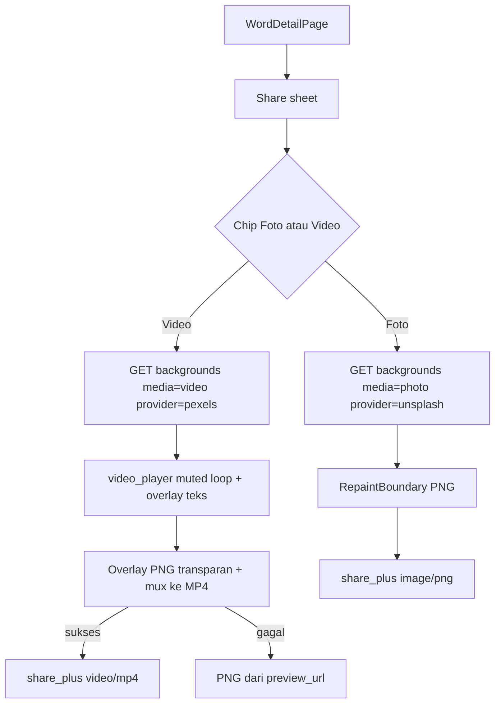

# SHARE_VIDEO - Latar foto dan video di editor kartu share

Catatan kontrak (2026-09-21), **sebelum** ditulis ke `docs/api/` dan
`docs/mobile/`. Melanjutkan V1 kartu share di
[`done/SHARE.md`](done/SHARE.md).

Estimasi implementasi setelah kontrak disalin: **3-4 hari** (setengahnya
export MP4).

> Prompt implementasi nanti:
> perbarui `docs/api/22-api-share-backgrounds.md`,
> `docs/mobile/11-mobile-share-card.md`, plus `docs/env/pexels.md`.
> File ini sumber kebenaran sampai langkah itu.

---

## Intent

Editor bagikan kosakata mendukung **foto dan video** sebagai latar.
Unsplash hanya foto, jadi API menambah provider kedua yang punya
**Video API**. Preview di sheet memutar video (muted, loop). Tombol
Bagikan menghasilkan **MP4** jika latar video, **PNG** jika foto
(perilaku V1).

Share tidak boleh rusak: provider video down → toast + fallback foto /
tanpa foto, sama seperti Unsplash degraded di V1.

---

## Situasi sekarang

V1 sudah live: PNG via `RepaintBoundary`, Unsplash proxy, galeri/kamera
foto, gambar kata ImageKit, editor tipografi.

Kode API sudah **lebih maju** dari `22-api-share-backgrounds.md`:

- `GET /api/v1/share/backgrounds?q=&page=&sort=&provider=&limit=`
- `GET /api/v1/share/background-providers`
- Registry `ShareBackgroundProviderId = 'unsplash'` saja
- Item: `id`, `url`, `photographer`, `username`, `attribution_url`,
  `unsplash_url` (alias), `provider`

Mobile sudah kirim `provider` / `sort` / `limit`. Capture hanya PNG.
`image_picker` hanya `pickImage`. Tidak ada `video_player`.

Batasan teknis yang memaksa kontrak export:

`RepaintBoundary.toImage()` **tidak** menangkap texture
`video_player`. Screenshot kartu berlatar video menghasilkan overlay
teks di atas kosong/hitam. Karena itu Bagikan video **bukan** reuse
jalur PNG V1.

---

## Keputusan (tetap sampai diganti di file ini)

1. **Provider video = Pexels.** Satu kunci, foto + video, hotlink
   diizinkan, atribusi wajib, kuota gratis 200 req/jam (cache 24 jam
   tetap wajib). Unsplash **tetap** provider foto default.
2. **Satu endpoint backgrounds**, bukan `/share/videos`. Query baru
   `media=photo|video` (default `photo` = client lama aman).
3. **Client pilih provider yang mampu.** `unsplash` + `media=video` →
   `400 VALIDATION_ERROR`. Jangan auto-switch diam-diam ke Pexels.
4. **Kunci Pexels tidak masuk APK.** Pola sama Unsplash.
5. **Output:** `kind=photo` → PNG; `kind=video` → MP4 muted, dipotong
   max 15 detik. Encode gagal → toast + bagikan poster (`preview_url`)
   sebagai PNG.
6. **Tanpa audio.** Stock video di-mute. Kartu kamus bukan reel bersuara.
7. **Perangkat:** galeri boleh foto **atau** video. Kamera V1 tetap foto
   saja (video kamera = sesi berikutnya).
8. **Query pencarian** tetap padanan + kategori, bukan lemma Sambas.
9. **Tidak** generate MP4 di API, tidak upload file user ke ImageKit
   hanya untuk share (keputusan V1 tetap).
10. **Tidak** ganti Unsplash. Pexels pelengkap, bukan pengganti.

Ditolak untuk V1 video:

| Opsi | Alasan |
| ---- | ------ |
| Pixabay | API video lebih kasar, kualitas tidak merata, watermark di sebagian aset |
| Coverr / Mixkit | Tidak ada search API yang setara Unsplash/Pexels |
| Giphy | GIF/meme, bukan stock b-roll |
| Campur Unsplash+Pexels dalam satu `items[]` tanpa `media` | Client lama menaruh `url` ke `Image.network` dan pecah jika `url` = MP4 |

---

## Alur



---

## Kontrak API

Mengikuti `api-base-stack.md` Section 8 (port), 13 (envelope), 15
(rate limit). Publik, tanpa auth, 30/menit per IP (tidak berubah).

### 1. Provider registry

`ShareBackgroundProviderId = 'unsplash' | 'pexels'`

Tiap impl port menyatakan kemampuan:

```ts
supportedMedia: Array<'photo' | 'video'>
```

| id | label | media | env |
| -- | ----- | ----- | --- |
| `unsplash` | Unsplash | `photo` | `UNSPLASH_ACCESS_KEY` |
| `pexels` | Pexels | `photo`, `video` | `PEXELS_API_KEY` |

Pexels foto **boleh** di registry (explorer nanti), tetapi editor V1
video memakai Pexels hanya untuk `media=video`. Chip Foto default tetap
Unsplash.

Factory: masukkan provider ke map hanya jika kuncinya terisi (pola
Unsplash sekarang).

### 2. GET `/api/v1/share/backgrounds`

Query (gabungan perilaku kode sekarang + video):

| Query | Aturan |
| ----- | ------ |
| `q` | wajib jika `sort=relevant`; trim 1-120; opsional jika `popular` |
| `page` | int ≥ 1, default `1` |
| `sort` | `relevant` (default) atau `popular` |
| `provider` | `unsplash` (default) atau `pexels` |
| `limit` | 1-30, default `3` |
| `media` | `photo` (default) atau `video` |
| `orientation` | opsional: `portrait` / `landscape` / `square`. Mobile story → `portrait`, post → `square` |

Validasi tambahan:

- `media=video` dan provider.supportedMedia tidak berisi `video` →
  400, field `media`, pesan: `Provider ini tidak mendukung video.`
- `provider` tidak ada di enum → 400, field `provider` (sudah ada).
- Provider dikenal tapi key kosong → **200** + `items: []` +
  `degraded: true` (bukan 5xx).

Cache key harus memuat media + orientation:

```
{provider}:{media}:{sort}:{q|popular}:{page}:{limit}:{orientation|any}
```

TTL tetap `SHARE_BACKGROUNDS_CACHE_TTL_SECONDS` (default 86400).

Upstream Pexels (hanya di infrastructure, bukan di client):

- Foto: `GET https://api.pexels.com/v1/search`
- Video: `GET https://api.pexels.com/videos/search`
- Popular video: `GET https://api.pexels.com/videos/popular`
- Header: `Authorization: $PEXELS_API_KEY`
- Filter video: `min_duration=3`, `max_duration=20` jika API mendukung
- Pilih `video_files[]`: `file_type=video/mp4`, quality `hd` dulu,
  lalu yang resolusi terdekat 1080 pada sisi pendek

### 3. Bentuk item (200)

Field lama **tetap ada** (client V1 tidak pecah untuk `media=photo`).

```json
{
  "success": true,
  "data": {
    "provider": "pexels",
    "query": "makan makanan",
    "page": 1,
    "cache_hit": false,
    "degraded": false,
    "media": "video",
    "items": [
      {
        "id": "pexels-video-2491284",
        "kind": "video",
        "provider": "pexels",
        "url": "https://player.vimeo.com/external/....mp4",
        "preview_url": "https://images.pexels.com/videos/....jpg",
        "width": 1080,
        "height": 1920,
        "duration_seconds": 12,
        "mime_type": "video/mp4",
        "photographer": "Jane Doe",
        "username": "janedoe",
        "attribution_url": "https://www.pexels.com/video/....",
        "unsplash_url": "https://www.pexels.com/video/...."
      }
    ]
  }
}
```

Aturan field:

| Field | Foto | Video |
| ----- | ---- | ----- |
| `kind` | `"photo"` (wajib di response baru; client lama boleh abaikan) | `"video"` |
| `url` | JPEG/WebP tampil di `Image.network` | **MP4 bisa diputar**, bukan thumbnail |
| `preview_url` | sama dengan `url` atau diisi | poster/thumbnail strip |
| `width` / `height` | opsional | wajib, dari file yang dipilih |
| `duration_seconds` | null / 0 | wajib, int ≥ 1 |
| `mime_type` | `image/jpeg` | `video/mp4` |
| `photographer` | fotografer | videografer (jangan rename field) |
| `unsplash_url` | alias `attribution_url` | alias yang sama, **bukan** berarti Unsplash |

`data.media` echo query (default `"photo"`) supaya client tidak tebak
dari item pertama.

### 4. GET `/api/v1/share/background-providers`

Response ditambah `media[]`:

```json
{
  "success": true,
  "data": {
    "providers": [
      { "id": "unsplash", "label": "Unsplash", "available": true, "media": ["photo"] },
      { "id": "pexels", "label": "Pexels", "available": true, "media": ["photo", "video"] }
    ]
  }
}
```

`available: false` jika key belum di-set. Mobile memakai ini untuk
menyalakan chip Video (tetap boleh tampil; request lalu degraded).

### 5. Env

| Var | Wajib | Default |
| --- | ----- | ------- |
| `UNSPLASH_ACCESS_KEY` | tidak | kosong → Unsplash degraded |
| `PEXELS_API_KEY` | tidak | kosong → Pexels degraded |
| `SHARE_BACKGROUNDS_CACHE_TTL_SECONDS` | tidak | `86400` |

Staging: `npx wrangler secret put PEXELS_API_KEY --env staging`.

Dokumen env baru saat implementasi: `docs/env/pexels.md` (cermin
`docs/env/unsplash.md`). Jangan tulis nilai kunci di markdown.

### 6. Error

Publik tetap 200 + degraded untuk gagal upstream. Kode internal (log /
opsional 502 di jalur non-publik) boleh reuse:

- `SHARE_BACKGROUND_PROVIDER_ERROR`
- `SHARE_BACKGROUND_PROVIDER_UNAVAILABLE`

Tidak perlu error_code baru kecuali ada jalur yang **tidak** di-swallow.

400 field `media` / `provider` / `q` / `page` / `orientation` memakai
pesan Indonesia pendek (aturan `api-pesan-validasi`).

### 7. Modul API (delta)

```
api/src/modules/share/
├── application/ports/share-background-provider.port.ts   # +pexels, +media
├── application/use-cases/list-share-backgrounds.use-case.ts  # cache key + validasi media
├── infrastructure/unsplash-background.provider.ts        # supportedMedia: photo
├── infrastructure/pexels-background.provider.ts          # BARU
├── infrastructure/share-background.factory.ts            # registry pexels
└── presentation/v1/validators/share-backgrounds.validator.ts
```

Tes unit: Pexels map `video_files` → one MP4; Unsplash + `media=video`
→ 400; Pexels tanpa key → degraded; cache memisahkan photo vs video.

Bruno / JSON (saat implementasi, bukan sekarang):

- `http/share/list-backgrounds-video.bru`
- `docs/json/share/list-backgrounds.video.200.json`
- `docs/json/share/list-backgrounds.video.200.empty.json`
- `docs/json/share/list-backgrounds.media-unsupported.400.json`

---

## Kontrak mobile

### Sumber latar

Ganti konsep `ShareBgSource.unsplash` menjadi sumber stok generik
(nama impl bebas, mis. `stock`), plus jenis media:

```
ShareMediaKind { photo, video }
ShareBgSource  { stock, device, wordImage, none }
```

Chip editor (urutan):

1. Foto stok (Unsplash, `media=photo`)
2. Video stok (Pexels, `media=video`)
3. Perangkat (foto atau video dari galeri; kamera = foto)
4. Gambar kata ImageKit (foto saja; tidak ada video kata di V1)
5. Tanpa foto (gradien / Poster Huruf)

Gaya template **Foto / Editorial / Bingkai** menerima foto **atau**
video. **Poster Huruf** tetap memaksa tanpa media.

Strip kandidat: 3 item. Video menampilkan `preview_url` + ikon play.
Tombol **Ganti** = `page++` (sama V1). Image Explorer: tab Foto |
Video; Video → `provider=pexels&media=video&sort=popular`.

Atribusi watermark: `SambasKu` + nama creator. Sumber Pexels boleh
menambah suffix kecil `Pexels` jika muat; jangan hilangkan nama orang.

### Preview

- Foto: `Image` seperti sekarang.
- Video: `video_player` (atau `media_kit` jika player baku gagal di
  texture overlay), **muted**, **looping**, `BoxFit.cover`, di bawah
  overlay gelap + teks.
- Loading video: skeleton / frame `preview_url`. Error load: fallback
  gradien + toast, Bagikan masih PNG.
- Jangan autoplay bersuara. Jangan kontrol seek di V1 (cukup loop).

`orientation` dikirim sesuai rasio: 9:16 → `portrait`, 1:1 → `square`.

### Export (inti risiko)

| Latar | Bagikan | Simpan galeri |
| ----- | ------- | ------------- |
| Foto / gradien | PNG (`share_plus` `image/png`) | `Gal.putImageBytes` |
| Video stok / video perangkat | MP4 muted ≤ 15 dtk | `Gal.putVideo` |
| Encode video gagal | PNG dari `preview_url` + overlay (jalur V1) | sama |

Langkah encode yang diizinkan kontrak:

1. Render **lapisan overlay saja** (teks + watermark, background
   transparan) lewat `RepaintBoundary` → PNG.
2. Ambil file video (download `url` ke temp, atau path galeri).
3. Mux overlay ke video, buang audio, trim `min(duration, 15)`.
4. Share `XFile(..., mimeType: 'video/mp4')` + caption yang sama V1.

Pilih compositor (urutan preferensi, putuskan di PR implementasi):

1. Native: AVFoundation (iOS) + MediaCodec/Mp4 composer (Android).
   APK tidak membengkak, lisensi aman.
2. `ffmpeg_kit_flutter_new` jika native > 1.5 hari. Catat ukuran APK
   di PR.

Jangan andalkan screenshot kartu utuh untuk video.

Caption tidak berubah:

```
"makatn" - makan · kamus bahasa Sambas #SambasKu
```

(String ini sudah ada di app; jangan ubah hanya karena media video.)

### Soft-fail (wajib)

- `GET background-providers` pexels `available: false` → chip Video
  tetap ada; tap → request → degraded toast.
- Shuffle page kosong → keep batch sebelumnya + toast (sudah ada).
- Video buffering lama (> ~8 dtk) → tetap boleh Bagikan via poster PNG.
- Offline: stok gagal; perangkat/gambar kata/gradien tetap.

### Dependensi baru (mobile)

- `video_player` (preview)
- compositor native atau ffmpeg (export)
- `image_picker.pickVideo` untuk galeri

Tidak taruh `PEXELS_API_KEY` di `envied`.

### Modul (delta)

```
mobile/lib/features/share/
├── domain/share_models.dart              # kind, duration, previewUrl, media
├── data/share_background_repository.dart # query media + orientation
└── presentation/
    ├── share_sheet.dart                  # chip Foto/Video, pickVideo
    ├── share_card_canvas.dart            # slot latar video
    ├── share_card_renderer.dart          # shareCardAsMp4
    └── widgets/share_video_layer.dart    # BARU, video_player
```

---

## Kompatibilitas

- Client lama tanpa `media`: server default `photo`. Item foto tetap
  punya `url` JPEG. Tidak breaking.
- Client baru **wajib** cek `kind` sebelum `Image.network(url)`.
- Field `unsplash_url` tidak dihapus.
- Docs `22-api-share-backgrounds.md` tertinggal (belum `provider` /
  `sort` / `limit` / `/background-providers`). Saat menyalin kontrak
  ini, **sinkronkan V1 yang sudah di kode** sekaligus video. Jangan
  tulis patch video di atas docs yang stale.

---

## Yang sengaja tidak masuk

- Generate MP4/PNG di API / Cloudflare
- Musik / suara di kartu
- Video dari ImageKit / kontribusi kata
- Rekam video dari kamera di editor
- Drag trim / timeline
- Provider ketiga (Pixabay) sampai Pexels kuota nyata habis
- Ganti Unsplash sebagai default foto

---

## Urutan kerja setelah file ini disetujui

1. Tulis ulang `docs/api/22-api-share-backgrounds.md` (V1 aktual + video).
2. Tulis ulang `docs/mobile/11-mobile-share-card.md` (editor foto+video).
3. Tambah `docs/env/pexels.md`.
4. Baru kerjakan kode API (Pexels port + query `media`) lalu mobile
   (preview), lalu export MP4, lalu Bruno/JSON.

Jangan mulai kode sebelum langkah 1-3.

---

## Checklist kontrak (centang saat disalin ke docs/api + docs/mobile)

- [ ] `media` + `kind` + `preview_url` + `duration_seconds` di OpenAPI
- [ ] `GET /background-providers` memuat `media[]`
- [ ] Env `PEXELS_API_KEY` + degraded tanpa key
- [ ] 400 jika Unsplash + video
- [ ] Cache key memuat `media`
- [ ] Preview muted loop vs Bagikan MP4 vs fallback PNG
- [ ] Galeri video; kamera tetap foto
- [ ] Caption, watermark creator, soft-fail
- [ ] Bruno + `docs/json/share/` video
- [ ] Setelah ship: pindah file ini ke `docs/backlogs/done/`
