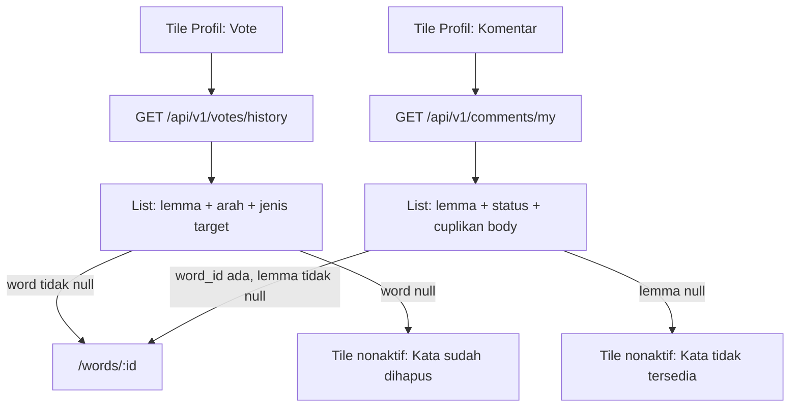

# VOTE + KOMENTAR di Profil - Riwayat aktivitas milik user

Catatan kontrak (2026-09-21), **sebelum** ditulis ke `docs/api/` dan
`docs/mobile/`. Menutup dua tile Profil yang sudah tampil sebagai toast
"segera hadir" (lihat [NEXT.md](../NEXT.md), Prioritas 1).

Estimasi implementasi setelah kontrak disalin: **1.5-2 hari** (API 0.75,
mobile 0.75). Tidak ada antrean admin baru.

> Prompt implementasi nanti: tulis `docs/api/25-api-my-votes.md`,
> `docs/api/27-api-my-comments.md`, `docs/mobile/16-mobile-vote-saya.md`,
> `docs/mobile/20-mobile-komentar-saya.md`. File ini sumber kebenaran
> sampai langkah itu. `26-api-bug-reports.md` /
> `15-mobile-report-bug.md` sudah dipesan
> [`REPORT_BUG.md`](../REPORT_BUG.md).

---

## Intent

User login buka tile **Vote** atau **Komentar** di Profil, melihat
daftar aktivitasnya sendiri (bukan milik orang lain, bukan agregat
publik), lalu tap baris → detail kata. Komentar menampilkan status
moderasi (`pending_review` / `published` / `rejected`) karena list
publik di detail kata **hanya** menayangkan yang sudah di-approve.
Tanpa halaman ini, komentar menunggu/ditolak tidak punya rumah di
aplikasi.

---

## Situasi sekarang

Diverifikasi 2026-09-21.

**UI Profil** (`mobile/lib/features/profile/presentation/pages/profile_page.dart:76-88`):
dua `FTile` di grup "Saya", `onPress` → `_comingSoon`. Subtitle sudah
menjanjikan "Kata yang pernah kamu vote" dan "Komentar & status
moderasi". Tile hanya tampil saat `status.isAuth`.

**Vote sudah hidup, tapi bukan riwayat:**

| Endpoint | Fungsi hari ini | Cukup untuk tile Profil? |
| -------- | --------------- | ------------------------ |
| `POST /api/v1/votes` | toggle +1/-1/batal | tidak |
| `GET /api/v1/votes/counts?targets=` | batch counts publik | tidak |
| `GET /api/v1/votes/my?targets=` | state tombol untuk id yang **client sudah pegang** | **tidak** - wajib `targets`, tanpa lemma, tanpa cursor |
| Admin `GET /api/v1/admin/votes` | moderasi semua user | bukan milik pemohon |

`GetMyVotesUseCase` (`api/src/modules/vote/application/use-cases/get-my-votes.use-case.ts`)
hanya `findUserVotes(userId, targets)`. Tidak ada `listByUser`.

**Komentar sudah hidup, tapi bukan milik saya:**

| Endpoint | Fungsi hari ini | Cukup untuk tile Profil? |
| -------- | --------------- | ------------------------ |
| `GET /api/v1/words/:wordId/comments` | published saja, per kata | tidak - bukan milik user; pending/rejected hilang |
| `POST /api/v1/words/:wordId/comments` | tulis, langsung `pending_review` | tidak |
| `DELETE /api/v1/comments/:id` | soft-delete penulis/verifikator | tidak |
| Admin `GET /api/v1/admin/comments` | antrean semua user | bukan milik pemohon |

`CommentRepository` punya `listByWord` (published) dan `listAdmin`
(semua status). Tidak ada `listByUser`. Index `(user_id, …)` belum ada
di `comments` maupun `votes`.

**Pola rumah yang harus diikuti, jangan diduplikasi:**

- List milik user + cursor: `GET /api/v1/bookmarks/my`,
  `GET /api/v1/contributions/my` (`21-api-my-contributions.md`)
- Join ringkasan kata di server: `BookmarkRepository.listByUser`
  (lemma + `word_type` + `is_verified`)
- Batch resolve target polymorphic: `VoteRepositoryImpl.resolveTargetPreviews`
  (admin votes - 2 fase: page lalu lookup per `entity_type`)
- Halaman mobile: `BookmarkPage` + `MyContributionsPage` (guest prompt,
  skeleton, empty, error+retry, pull-to-refresh, load more)
- Route root navigator: `BookmarkRouter` `/bookmarks`

Fondasi yang **tidak** disentuh: toggle vote, counts, `GET /votes/my?targets=`,
list komentar per kata, antrean admin, profil publik (`19-api-profil-publik.md`
sengaja tanpa riwayat aktivitas).

---

## Keputusan (tetap sampai diganti di file ini)

1. **Dua endpoint baru, dua halaman baru.** Bukan satu feed campur vote
   + komentar. Tile Profil sudah dua; list sederhana lebih mudah
   di-filter.
2. **Jangan overload `GET /api/v1/votes/my`.** Endpoint itu wajib
   `targets` (state tombol). Dual-mode ala bookmark (`word_ids` vs
   cursor) akan mengubah 400 → 200 dan merusak kontrak OpenAPI/Bruno
   yang sudah ship. Path baru: `GET /api/v1/votes/history`.
3. **Komentar: `GET /api/v1/comments/my`.** Pola `/resource/my`
   (bookmark, contributions). Mount **sebelum** `DELETE /:id` supaya
   `"my"` tidak tertelan param.
4. **Join lemma di server.** Client tidak boleh N+1
   `GET /words/:id` per baris (amanat NEXT.md). Item vote membawa
   `word` ringkas; item komentar membawa `word_id` + `word_lemma`.
5. **Vote V1 = semua `target_type` yang sudah ada**
   (`word|meaning|example|pronunciation|word_image|comment`). Mobile
   hari ini hanya vote kata + komentar, tetapi API sudah polymorphic;
   filter jenis di query opsional supaya admin/API client tidak butuh
   endpoint kedua. Default = semua jenis.
6. **Parent word di-resolve batch, `word` nullable.** Pagination
   berdasarkan `votes.id` (jangan drop baris setelah LIMIT - page
   jadi pendek, `has_more` salah). Target/kata hilang → `word: null`;
   UI nonaktifkan tap. Pola resolve = `resolveTargetPreviews` yang
   sudah ada, plus hop ke `words`:
   - `word` → `words.id`
   - `meaning` → `meanings.word_id`
   - `example` → `examples.meaning_id` → `meanings.word_id`
   - `pronunciation` → `pronunciations.word_id`
   - `word_image` → `word_images.word_id`
   - `comment` → `comments.word_id`
   Kata `deleted_at` terisi = treat sebagai hilang (`word: null`).
7. **Komentar milik penulis: semua status, kecuali soft-delete.**
   Inilah satu-satunya permukaan user untuk melihat
   `pending_review` / `rejected`. Filter query `status` opsional
   (kosakata Section 22, sama admin). `user_id` / `username` tidak
   dikirim (selalu pemohon). `reviewed_at` dikirim; identitas reviewer
   tidak.
8. **Urutan = `id DESC` (ULID time-sortable).** Vote: waktu **pasang
   pertama**, bukan ganti arah (`updated_at` diabaikan di V1). Komentar:
   waktu tulis. Cursor = id item terakhir, `id < cursor` (Section 13).
9. **List V1 tampilan + navigasi, bukan aksi.** Tidak unvote / hapus
   komentar dari halaman Profil. Aksi tetap di detail kata (tombol
   vote + hapus komentar yang sudah ada). Hindari tap salah di list.
10. **Auth wajib, semua role.** Tamu tidak melihat tile; kalau buka
    route langsung → 401 API + prompt Masuk di halaman (pola Bookmark).
11. **Tidak ada error_code baru.** Reuse `VALIDATION_ERROR`,
    `UNAUTHORIZED`, `RATE_LIMITED`.
12. **Tidak ada audit, tidak ada env baru, tidak ada tabel baru.**
    Hanya index. Vote/komentar sudah diputuskan tidak diaudit per aksi
    user (08, 09).
13. **Statistik agregat di kartu Profil bukan V1** (NEXT.md: "bisa
    menyusul"). Publik profil tetap tanpa feed aktivitas (19).

Ditolak untuk V1:

| Opsi | Alasan |
| ---- | ------ |
| Dual-mode `GET /votes/my` tanpa `targets` | Mengubah semantik endpoint yang sudah di-ship; 400 jadi 200 |
| Satu endpoint campur vote+komentar | Dua tile, dua siklus (vote hard-delete vs komentar soft-delete + status) |
| Hanya `target_type=word` | API sudah 6 jenis; filter query lebih murah daripada endpoint kedua nanti |
| Drop baris jika kata hilang | Merusak LIMIT+1 / `has_more` |
| Group by kata (satu baris per lemma) | Kehilangan arah vote dan jenis target; grouping = delta |
| Unvote / hapus dari list | Aksi sudah ada di detail; list Profil = arsip |
| Feed di profil publik | Ditolak eksplisit di 19 |
| Count upvote/downvote di item riwayat | Extra join; bukan yang user cari di halaman ini |

---

## Alur



---

## Kontrak API

Mengikuti `api-base-stack.md`: envelope Section 13, ULID Section 19,
cursor pagination Section 13, rate limit Section 15. **Env baru: tidak
ada. Tabel baru: tidak ada.**

Delta modul yang sudah ada (`modules/vote`, `modules/comment`).

### 1. Index (+ `docs/dbdiagram.dbml`)

Migration `pnpm drizzle-kit generate --name=user-activity-indexes`.

| Tabel | Index | Alasan |
| ----- | ----- | ------ |
| `votes` | `(user_id, id)` | `ORDER BY id DESC` milik satu user; unique lama `(user_id, entity_type, entity_id)` tidak membantu list |
| `comments` | `(user_id, status, id)` | list semua + filter status |

Tanpa backfill. Unique vote dan index komentar per-kata **tetap**.

### 2. `GET /api/v1/votes/history`

Login, semua role. Rate 100/menit per `user_id` (tier baca milik
sendiri, sama `contributions/my`). **Bukan** mengganti
`GET /api/v1/votes/my?targets=`.

Query:

| Field | Aturan | Default |
| ----- | ------ | ------- |
| `limit` | int 1-50 | 20 |
| `cursor` | ULID 26, opsional | - |
| `target_type` | enum 6 jenis, opsional | semua |
| `value` | `1` atau `-1`, opsional | semua |

Response 200:

```json
{
  "success": true,
  "data": [
    {
      "id": "01JDVOTESMAKATN00000000001",
      "target_type": "word",
      "target_id": "01JDWORDMAKATN0000000000A",
      "value": 1,
      "voted_at": "2026-09-21T10:00:00.000Z",
      "word": {
        "id": "01JDWORDMAKATN0000000000A",
        "lemma": "makatn",
        "word_type": "lemma",
        "is_verified": true
      }
    },
    {
      "id": "01JDVOTESCOMMENT0000000002",
      "target_type": "comment",
      "target_id": "01JDCOMMENTMAKATN00000000A",
      "value": -1,
      "voted_at": "2026-09-21T09:00:00.000Z",
      "word": {
        "id": "01JDWORDMAKATN0000000000A",
        "lemma": "makatn",
        "word_type": "lemma",
        "is_verified": true
      }
    }
  ],
  "meta": {
    "limit": 20,
    "next_cursor": null,
    "has_more": false
  }
}
```

- `voted_at` = `votes.created_at` ISO
- `word` = `null` jika parent tidak ada / `deleted_at` terisi
- Bentuk `word` = subset bookmark (`id`, `lemma`, `word_type`,
  `is_verified`) supaya mapper mobile bisa reuse konsep
- `GET /votes/my?targets=` **tidak berubah** (tanpa meta, tanpa word)

Use case baru `ListMyVoteHistoryUseCase`. Repo:
`listByUser(userId, { limit, cursor, targetType?, value? })` → page
vote lalu `resolveParentWords` (satu batch per jenis, pola
`resolveTargetPreviews`). Jangan 6-way JOIN di satu SELECT.

### 3. `GET /api/v1/comments/my`

Login, semua role. Rate 100/menit per `user_id`. Mount di
`createCommentRoutes` (`/api/v1/comments`) path `/my` **sebelum**
`/:id`.

Query:

| Field | Aturan | Default |
| ----- | ------ | ------- |
| `limit` | int 1-50 | 20 |
| `cursor` | ULID 26, opsional | - |
| `status` | `pending_review` \| `published` \| `rejected`, opsional | semua |

`deleted_at IS NULL` selalu. Tidak ada filter `word_id` (itu milik
admin / list per kata).

Response 200:

```json
{
  "success": true,
  "data": [
    {
      "id": "01JDCOMMENTMAKATN00000000A",
      "word_id": "01JDWORDMAKATN0000000000A",
      "word_lemma": "makatn",
      "body": "Kata ini juga sering saya dengar di daerah Sambas",
      "status": "pending_review",
      "created_at": "2026-09-21T10:00:00.000Z",
      "reviewed_at": null
    }
  ],
  "meta": {
    "limit": 20,
    "next_cursor": null,
    "has_more": false
  }
}
```

- `word_lemma` nullable (JOIN `words` yang sudah ada di
  `selectBase()` komentar)
- `body` penuh (maks 1000, sudah divalidasi saat create); client yang
  memotong untuk subtitle
- Tidak ada `upvotes` / `downvotes` / `user_id` / `username` /
  `reviewed_by`

Use case baru `ListMyCommentsUseCase`. Repo: `listByUser(userId, {
limit, cursor, status? })` - copy pola `listAdmin` ganti filter
`userId` milik pemohon.

401 tanpa token. Query rusak → 400 `VALIDATION_ERROR`.

### 4. Error (reuse)

| HTTP | error_code | Kapan |
| ---- | ---------- | ----- |
| 400 | `VALIDATION_ERROR` | limit/cursor/enum salah |
| 401 | `UNAUTHORIZED` | token tidak ada/invalid |
| 429 | `RATE_LIMITED` | 100/menit per user_id |

Tidak menambah baris di `ERROR_CODES.md`.

### 5. Modul API (delta)

```
api/src/modules/vote/
├── application/use-cases/list-my-vote-history.use-case.ts   # BARU
├── domain/repositories/vote.repository.ts                   # +listByUser
├── infrastructure/vote.repository.impl.ts                   # +resolveParentWords
└── presentation/v1/
    ├── vote.routes.ts                                       # +GET /history
    ├── vote.controller.ts                                   # +history()
    └── validators/vote.validator.ts                         # +history query/response

api/src/modules/comment/
├── application/use-cases/list-my-comments.use-case.ts       # BARU
├── domain/repositories/comment.repository.ts                # +listByUser
├── infrastructure/comment.repository.impl.ts
└── presentation/v1/
    ├── comment.routes.ts                                    # +GET /my sebelum /:id
    ├── comment.controller.ts                                # +my()
    └── validators/comment.validator.ts                      # +my query/response
```

Plus: schema drizzle index, `docs/dbdiagram.dbml`, `app.ts` wiring
use case baru (controller deps).

Tes unit / e2e (extend file yang sudah ada, jangan suite baru kecuali
perlu):

- Vote history: user A tidak melihat vote user B; cursor `has_more`;
  filter `target_type` + `value`; `word` terisi untuk 6 jenis;
  `word: null` jika kata soft-delete; `GET /votes/my?targets=` tetap
  400 tanpa `targets` dan bentuk lama jika `targets` ada
- Komentar my: pending + rejected ikut; published ikut; soft-delete
  tidak; filter `status`; penulis lain 0 baris; `GET /words/:id/comments`
  tetap published-only
- Rate 429 (pola e2e contributions/my bila sudah ada; kalau tidak,
  unit keyFn cukup)

Bruno / JSON (saat implementasi):

- `http/vote/history.bru`, `http/comment/my-comments.bru`
- `docs/json/vote/vote-history.200.json`,
  `docs/json/comment/my-comments.200.json`
- `docs/json/README.md` pemetaan endpoint

---

## Kontrak mobile

Mengikuti `mobile-base-stack.md` Section 2/5/6/10. Pola halaman =
Bookmark + Kontribusi Saya. Data layer Dio langsung (tanpa
retrofit/freezed) seperti `features/my_contributions/` - payload
ringkas, tidak dibagi modul lain. Fitur `features/vote` yang ada
**tetap** untuk tombol di detail; jangan dicampur datasource history
ke `VoteController` family-by-target.

### Route

| Path | Halaman |
| ---- | ------- |
| `/votes` | `MyVotesPage` |
| `/comments` | `MyCommentsPage` |

Root navigator (`parentNavigatorKey: AppRouter.rootNavigatorKey`),
pola `BookmarkRouter`. Tile Profil: `context.push('/votes')` /
`context.push('/comments')` - ganti `_comingSoon`.

### Vote (`features/my_votes/`)

```
mobile/lib/features/my_votes/
├── domain/   entities + failure + repository + use case list
├── data/     repository_impl (Dio GET /votes/history)
├── presentation/
│   ├── models/my_votes_state.dart
│   ├── providers/my_votes_providers.dart
│   └── pages/my_votes_page.dart
└── my_votes_router.dart
```

Perilaku:

1. `MyVotesListController` keepAlive. Guest = state kosong + prompt
   Masuk (copy Bookmark). Login = halaman pertama limit 20.
   `loadMore` guard `hasMore && nextCursor`. Invalidate di
   login/logout (`AuthStatusNotifier`) **dan** setelah
   `VoteController.toggle` sukses (supaya pop dari detail tidak
   menampilkan vote yang baru dibatalkan).
2. List `FTileGroup`. Judul = `word.lemma` atau "Kata sudah dihapus".
   Subtitle = `{Upvote\|Downvote} · {label target} · {tanggal}`.
   Label target: Kata / Arti / Contoh / Pelafalan / Gambar / Komentar.
   Suffix chevron hanya jika `word != null`.
3. Tap: `context.push('/words/${word.id}')`. `word == null` → tidak
   ada aksi.
4. Pull-to-refresh, skeleton, kosong "Belum ada vote", error + coba
   lagi. **Tanpa** chip filter di V1 (query `target_type`/`value`
   disiapkan API, UI menyusul).
5. Tidak ada swipe-unvote.

### Komentar (`features/my_comments/`)

Struktur mirror `my_votes/`. Endpoint `GET /comments/my`.

Perilaku tambahan:

1. Chip status di atas list: Semua / Menunggu / Tayang / Ditolak
   (`null` / `pending_review` / `published` / `rejected`). Ganti chip
   = fetch ulang cursor dari awal.
2. Judul = `word_lemma` atau "Kata tidak tersedia". Subtitle =
   `{status label} · {cuplikan body 80 char} · {tanggal}`.
3. Tap hanya jika `word_lemma != null` → `/words/:word_id`. Komentar
   pending/rejected **tidak** di-scroll di detail (list publik
   published-only); user sudah baca isinya di halaman ini. V1 tidak
   deep-link ke komentar.
4. Kosong: "Belum ada komentar" / "Tidak ada komentar dengan status
   ini" saat filter ≠ Semua.
5. Tidak ada hapus dari list.

Guest prompt: copy Bookmark, ganti copy ("Masuk dulu untuk melihat
vote/komentar kamu").

### Label status komentar (satu sumber)

| API | UI |
| --- | -- |
| `pending_review` | Menunggu |
| `published` | Tayang |
| `rejected` | Ditolak |

### Tes widget

- Tile Profil Vote/Komentar **tidak** memanggil toast; push route
  (extend `profile_page_test.dart`)
- List vote: empty, error+retry, tap lemma → `/words/:id`, baris
  `word: null` tidak navigasi
- List komentar: chip filter mengirim `status=`; pending tampil;
  lemma null tidak navigasi

`flutter analyze` bersih.

---

## Kompatibilitas

- `GET /api/v1/votes/my?targets=` bentuk lama, wajib `targets`.
- `GET /api/v1/words/:wordId/comments` tetap published-only.
- Admin votes/comments tidak berubah.
- Profil publik (19) tidak bertambah field.
- Mobile `features/vote` (tombol) dan `features/comment` (section
  detail kata) tidak dipecah; history = fitur baru.

---

## Yang sengaja tidak masuk

- Statistik upvote/komentar di kartu identitas Profil
- Feed aktivitas di `GET /users/:username`
- Unvote / hapus / edit komentar dari list Profil
- Group by lemma
- Chip filter vote di mobile (API sudah siap)
- Deep-link ke komentar tertentu di detail kata
- Notifikasi saat komentar di-approve/reject (modul 23 sudah cover
  kontribusi kata, bukan komentar - delta terpisah)
- Admin UI baru

---

## Urutan kerja setelah file ini disetujui

1. Tulis `docs/api/25-api-my-votes.md` + `docs/api/27-api-my-comments.md`
   + update `dbdiagram.dbml` (index saja).
2. Tulis `docs/mobile/16-mobile-vote-saya.md` +
   `docs/mobile/20-mobile-komentar-saya.md`.
3. Kode API: migration index + `listByUser` vote/comment + tes.
4. Mobile: dua fitur + router + ganti toast tile Profil.
5. Bruno + `docs/json/`.

Jangan mulai kode sebelum langkah 1-2.

---

## Checklist kontrak (centang saat disalin ke docs/api + docs/mobile)

- [x] Index `votes(user_id, id)` + `comments(user_id, status, id)` + dbml
- [x] `GET /api/v1/votes/history` cursor + join `word` nullable + filter opsional
- [x] `GET /api/v1/votes/my?targets=` tidak berubah
- [x] `GET /api/v1/comments/my` semua status kecuali soft-delete + filter status
- [x] List publik per kata tidak diubah fitur ini (post-moderation: status publik, body non-published null)
- [x] Rate 100/menit per user_id; tidak ada error_code baru
- [x] Mobile: `/votes` + `/comments`, chip status hanya di komentar
- [x] Tile Profil tidak lagi toast
- [x] Bruno + `docs/json/vote/vote-history.200.json` +
      `docs/json/comment/my-comments.200.json`
- [x] Setelah ship: pindah file ini ke `docs/backlogs/done/`
