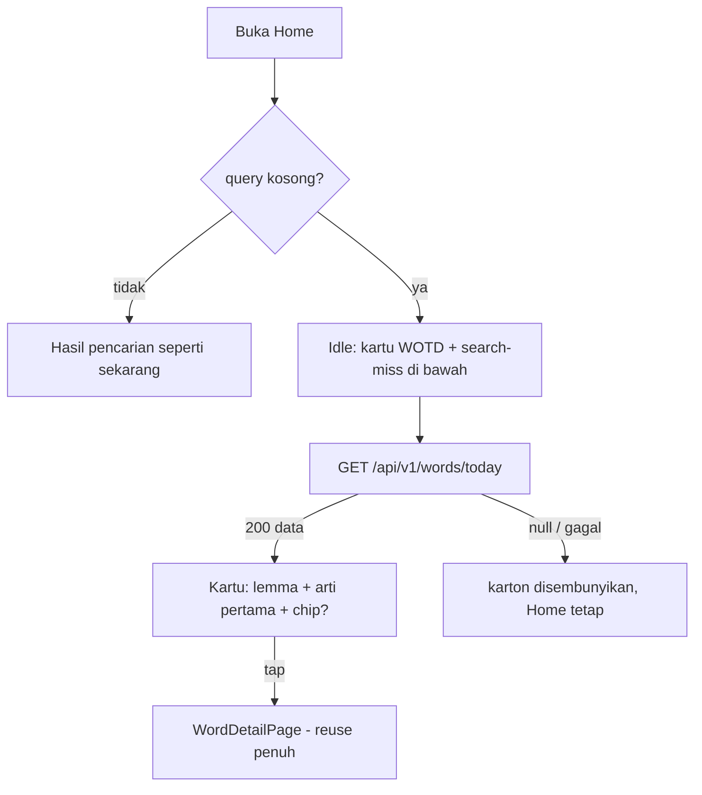

# WORD_OF_THE_DAY - Kata Hari Ini di beranda Home

Catatan kontrak (2026-09-21), **sebelum** ditulis ke `docs/api/` dan
`docs/mobile/`. Item "Discovery di Home" dari
[NEXT.md](NEXT.md) (Medium - retensi pengguna akhir).

Estimasi implementasi setelah kontrak disalin: **1-1.5 hari** (API
0.5, mobile 0.5-1). Fitur murah, tanpa tabel baru.

> Prompt implementasi nanti: tulis `docs/api/28-api-word-of-the-day.md`
> dan `docs/mobile/17-mobile-word-of-the-day.md` (cek nomor terakhir
> saat implementasi; 25-27 tercadang backlog lain). File ini sumber
> kebenaran sampai langkah itu.

---

## Intent

Saat query kosong, Home beranda menampilkan kartu **Kata Hari Ini**:
satu kata terbit yang dipilih deterministik per tanggal (semua user
melihat kata yang sama tiap hari). Tap kartu → detail kata. Kartu
hanya ada di state idle - **tidak mengganggu pencarian**: begitu user
mengetik, kartu hilang, hasil pencarian mengambil alih.

Mengubah Home dari "duplikat tab Kontribusi" (hanya list search-miss)
menadi beranda yang terasa kamus: tiap buka app ada satu kata baru
untuk dipelajari.

---

## Situasi sekarang

- Home idle (`home_search_page.dart`) menampilkan list search-miss -
  duplikat isi tab Kontribusi (keluhan NEXT.md).
- `words` TIDAK punya kolom `published_at`; timestamp terbit paling
  akurat yang ada = `verified_at` (di-set approval gate saat publish,
  termasuk self-publish admin).
- Word detail endpoint + `WordDetailDto` mobile sudah lengkap
  (meanings, categories, pronunciations, images, relatedWords,
  appearsIn, variants, translations, examples) - bisa di-reuse utuh.
- Tidak ada infra khusus yang dibutuhkan: cache in-memory pola share
  backgrounds sudah ada.

---

## Keputusan (tetap sampai diganti di file ini)

1. **Seed tanggal, bukan acak per request.** Semua user lihat kata
   yang sama per hari: bisa dibagikan ("kata hari ini"), cache satu
   entry per hari, dan deterministik. Pilihan NEXT.md menawarkan dua
   opsi - yang ini diambil.
2. **Pemilihan stateless tanpa tabel baru**:

   ```sql
   SELECT ... FROM words
   WHERE status = 'published' AND deleted_at IS NULL
   ORDER BY md5(id || ':' || $tanggal)   -- $tanggal = 'YYYY-MM-DD' WIB
   LIMIT 1
   ```

   Tidak ada pointer, tidak ada COUNT, tidak ada OFFSET. Distribusi
   merata per hari; kata bisa terulang sebelum satu putaran penuh -
   diterima untuk V1. Kalau nanti mau rotasi adil (semua kata
   kebagian sebelum terulang), tambah tabel log kecil - jangan
   sekarang.
3. **Zona waktu = Asia/Jakarta (UTC+7, tanpa DST).** Tanggal "hari
   ini" dihitung server di WIB, semua user Indonesia satu kata.
4. **Endpoint `GET /api/v1/words/today`** - publik, tanpa auth,
   rate limit 100/menit per IP (kategori baca rumah). Response =
   **payload word detail yang sama** dengan `GET /words/:id`, plus
   dua field tambahan di level `data`: `date` (`"2026-09-21"`) dan
   `is_new_this_week` (boolean). Client reuse parsing + navigasi
   detail tanpa kode baru.
5. **Chip "Kata baru minggu ini"** muncul di kartu saat
   `verified_at >= now() - 7 hari`. Proxy sadar: `verified_at` bisa
   berubah oleh verify/unverify pasca-publikasi - chip ini sinyal
   marketing, bukan akuntansi. Migrasi kolom `published_at` = kalau
   presisi jadi penting.
6. **Korpus kosong** (belum ada kata published): 200 `data: null` -
   state normal, bukan error. Client menyembunyikan kartu.
7. **Cache in-memory per tanggal**: hasil query + build response
   di-cache sampai tanggal WIB berganti (pola TTL share backgrounds;
   per-isolate di Workers - aman karena hasilnya deterministik,
   cache hanya untuk performa).
8. **Home idle: kartu WOTD di posisi teratas, list search-miss tetap
   di bawah.** Backlog ini TIDAK menghapus search-miss dari Home -
   keluhan duplikasi dengan tab Kontribusi adalah keputusan UX
   terpisah. Kartu mengubah Home dari "hanya duplikat" menjadi
   beranda; sisanya menyusul kalau masih terasa dobel.
9. **Guest melihat kartu** (endpoint publik) - discovery adalah fitur
   retensi justru sebelum login.

Ditolak untuk V1:

| Opsi | Alasan |
| ---- | ------ |
| Acak per request | Tiap refresh ganti kata; tidak bisa dibagikan; cache tidak berguna |
| Tabel pointer / log rotasi harian | State + migration untuk masalah (rotasi adil) yang belum dirasakan |
| OFFSET day % COUNT(\*) | COUNT dan OFFSET dua-duanya anti-pola rumah; plus offset scan |
| Kolom baru `published_at` + backfill | Hanya dipakai satu chip; `verified_at` cukup sebagai proxy |
| Chip di semua list kata (hasil cari, list) | Perlu field baru di banyak response; V1 cukup di kartu WOTD |
| Notifikasi push "kata hari ini" | Push masih ditunda NEXT.md sampai inbox terpakai |
| Tombol share di kartu | Share V1 sudah ada di detail kata; tap kartu → detail → share |

---

## Alur



---

## Kontrak API

Mengikuti `api-base-stack.md`: envelope Section 13, tanpa auth,
tanpa env baru, tanpa migration.

### 1. `GET /api/v1/words/today`

| Aspek | Aturan |
| ----- | ------ |
| Auth | publik |
| Rate limit | 100/menit per IP (kategori baca) |
| Cache | in-memory per tanggal WIB; invalid saat tanggal berganti |
| Korpus kosong | 200 `{ "success": true, "data": null }` |

Response 200 (bentuk = word detail existing + 2 field):

```json
{
  "success": true,
  "data": {
    "id": "01HXYZ...",
    "lemma": "makatn",
    "meanings": [ ... ],
    "categories": [ ... ],
    "pronunciations": [ ... ],
    "images": [ ... ],
    "related_words": [ ... ],
    "appears_in": [ ... ],
    "variants": [ ... ],
    "date": "2026-09-21",
    "is_new_this_week": false
  }
}
```

`is_new_this_week` dihitung server: `status='published'` dan
`verified_at >= now() - interval 7 hari`.

### 2. Jebakan routing (WAJIB)

Route `today` **harus didaftarkan sebelum** `GET /words/:id` di
`word.routes.ts` - kalau tidak, `today` tertangkap param `:id` (dan
gagal validasi ULID 400). Ini satu-satunya gotcha implementasi API.

### 3. Modul (delta)

```text
api/src/modules/word/
├── application/use-cases/get-word-of-day.use-case.ts   # BARU
│   # md5(id||tanggal) LIMIT 1 + cache per tanggal + flag mingguan
└── presentation/v1/word.routes.ts                      # +today sebelum :id
```

Tes unit: tanggal sama → kata sama (deterministik); tanggal beda →
query memakai tanggal baru; korpus kosong → null; `is_new_this_week`
true/false dari `verified_at`; cache mengembalikan instance sama
dalam satu tanggal.

Bruno / JSON (saat implementasi):

- `http/word/get-word-of-day.bru`
- `docs/json/word/get-word-of-day.200.json`,
  `get-word-of-day.empty.200.json`

---

## Kontrak mobile

### Provider & model

- `wordOfDayProvider` (FutureProvider) - fetch saat Home idle
  pertama kali; refresh mengikuti siklus hidup provider biasa
  (invalidate saat app cold start; tidak perlu timer pergantian
  hari di V1).
- Parsing: **reuse `WordDetailDto`** apa adanya (field `date` dan
  `is_new_this_week` diabaikan DTO lama; baca dari JSON mentah untuk
  chip, atau tambah field optional di DTO - pilih saat implementasi,
  jangan pecah model existing).

### Kartu `WordOfDayCard`

- Hanya dirender di state **idle** (query kosong); hilang begitu
  ada query - tidak menahan focus, tidak menutup hasil.
- Isi: label kecil "Kata Hari Ini" + tanggal,
  lemma besar, arti pertama (ringkas satu baris, ellipsis),
  chip **"Kata baru minggu ini"** hanya saat flag true.
- Tap → `WordDetailPage` (navigasi + model reuse penuh).
- Loading: shimmer kecil seukuran kartu; error/null: kartu
  disembunyikan diam-diam (soft-fail - Home tidak boleh rusak karena
  WOTD gagal); offline sama: hilang.
- Guest: tampil seperti user login.

### Modul (delta)

```text
mobile/lib/features/dictionary/
├── data/ (endpoint + provider WOTD)
└── presentation/
    ├── providers/word_of_day_provider.dart   # BARU
    └── widgets/word_of_day_card.dart         # BARU
```

`home_search_page.dart`: sisipkan kartu di atas list search-miss
pada state idle. Tidak ada perubahan di alur pencarian.

### Dependensi baru

Tidak ada.

---

## Kompatibilitas

- Endpoint + kartu baru total; tidak ada client lama yang pecah.
- Response = superset word detail: parser lama aman.
- `GET /words/:id` tidak berubah; hanya urutan registrasi route.

---

## Yang sengaja tidak masuk

- Rotasi adil semua kata sebelum terulang (tabel log)
- Kolom `published_at` + backfill (chip pakai proxy `verified_at`)
- Chip "baru" di hasil pencarian / list kata lain
- Notifikasi push / widget harian
- Tombol share langsung di kartu (share ada di detail)
- Arsip "kata hari ini kemarin" (history WOTD)
- Cache lintas restart di mobile (in-memory provider cukup; cache
  offline adalah backlog NEXT.md terpisah)

---

## Urutan kerja setelah file ini disetujui

1. Tulis `docs/api/28-api-word-of-the-day.md` +
   `docs/mobile/17-mobile-word-of-the-day.md`.
2. API: use-case + route (ingat: `today` sebelum `/:id`) + tes unit.
3. Mobile: provider + kartu + penyisipan Home idle.
4. Bruno + JSON fixtures.
5. Smoke: kartu muncul di staging, hilang saat mengetik, tap ke
   detail.

Jangan mulai kode sebelum langkah 1.

---

## Checklist kontrak (centang saat disalin ke docs/api + docs/mobile)

- [x] Deterministik `md5(id || ':' || tanggal WIB)`, tanpa COUNT/OFFSET
- [x] Route `today` terdaftar sebelum `/:id`
- [x] Response = word detail + `date` + `is_new_this_week`
- [x] Korpus kosong → 200 `data: null`, kartu hilang di mobile
- [x] Cache in-memory per tanggal WIB
- [x] Rate limit 100/menit per IP
- [x] Kartu hanya state idle; mengetik = hilang
- [x] Chip kondisional dari flag server
- [x] Tap → detail; guest tampil
- [x] Bruno + `docs/json/word/`
- [ ] Setelah ship: pindah file ini ke `docs/backlogs/done/`
